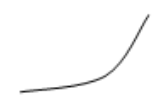
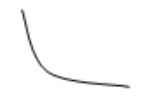

# AN Summary 26.01.2022

[TOC]

| Begriff               | Erklärung                                                    |
| --------------------- | ------------------------------------------------------------ |
| gerade Funktion       | Wenn der Graph achsensymmetrisch mit der y-Achse ist (wie bei $x^2$) |
| ungerade Funktion     | Wenn der Graph punktsymmetrisch mit dem Nullpunkt ist (wie bei $x^3$) |
| Komposition           | $(g\circ f)(x)=g(f(x))$                                      |
| Injektive Funktion    | Keine zwei $x$ führen zum selben $y$. Von einer injektiven Funktion gibt es eine Umkehrfunktion. |
| $\sum^5_{k=1}a_k$     | Addiert $a_k$ bis (inklusiv) $5$: $a_1+a_2+a_3+a_4+a_5$      |
| Übliche Summenformeln | $\sum^n_{k=1}k=\frac{n(n+1)}2$ $\sum^n_{k=1}k^2=\frac{n(n+1)(2n+1)}6$ |
| Polynomfunktion       | $f(x)=a_n\cdot x^n+a_{n-1}\cdot x^{n-1}+..+a_1\cdot x + a_0$ |
| Komposition           | $(g\circ f)(2)=g(f(2))$                                      |
| Funktion              | Mapt vom Definitionsbereich $D$ zum Wertebereich $W$         |
| Mitternachtsformel    | $D=b^2-4ac$ und $x=\frac{-b\pm \sqrt D}{2a}$                 |

## Ableiten

| Name                            | Formel                                                       |
| ------------------------------- | ------------------------------------------------------------ |
|                                 | $x^k=k\cdot x^{k-1}$                                         |
| Faktorregel                     | $(c\cdot f)'(x)=c\cdot f'(x)$                                |
| Summenregel                     | $(f+g)'(x)=f'(x)+g'(x)$                                      |
| Produktregel                    | $(u\cdot v)'(x)=u'(x)\cdot v(x)+u(x)\cdot v'(x)$             |
| Quotientenregel                 | $(\frac u v)'(x)=\frac{u'(x)\cdot v(x)-u(x)\cdot v'(x)}{v(x)^2}$ |
| Kettenregel                     | $(F\circ u)'(x)=F'(x)\cdot u'(x)$                            |
| sin                             | $sin(x)'=cos(x)$                                             |
| cos                             | $cos(x)'=-sin(x)$                                            |
| $e^x$                           | $(e^x)'=e^x$                                                 |
| $(a^x)'$                        | $(a^x)'=a^x\cdot \ln(a)$                                     |
| $\ln(x)'$                       | $\ln(x)'=\frac 1 x$                                          |
| $\log_a(x)'$                    | $\log_a(x)'=\frac 1 {x\cdot \ln(a)}$                         |
| Funktionsgleichung für Tangente | $y(x)=f'(x_0)\cdot (x-x_0)+f(x_0)$                           |

> **Achtung**: Nicht jede Funktion ist differenzierbar. Die Ableitung einer Funktion darf keine plötzliche Sprünge machen

### Newton Verfahren

$x_{n+1}=x_n-\frac{f(x_n)}{f'(x_n)}$

## Integrieren

Ableiten: $a\cdot x^n\rightarrow \frac{a}{n+1}\cdot x^{n+1}$

> Schreibweise von Integral von der Fläche zwischen $[a;b]$:  $\int^b_a f(x) \mathrm d x =F(b)-F(a)$$

- $\int a^x \mathrm d x =\frac {a^x}{\ln(a)} + C$
- $\int \ln(x)\mathrm dx=x\cdot \ln(x)-x + C$
- $\int \log_a(x)\mathrm dx=\frac 1 {\ln(a)}\cdot (x \cdot \ln(x) -x) + C$
- $\int \sin(x)\mathrm dx=-\cos(x)+C$
- $\int \cos(x)\mathrm dx=\sin(x)+C$
- $\int \tan(x)\mathrm dx = -\ln |\cos(x)|+C$

## Reihen & Folgen

| Name                | explizite Darstellung | implizite Darstellung               | aufzählende Darstellung                    |
| ------------------- | --------------------- | ----------------------------------- | ------------------------------------------ |
| Arithmetische Folge | $a_n=c+(n-1)\cdot d$  | $a_1=c\\a_{n+1}=a_n+d$              | $c,c+d,c+2d,c+3d,...$                      |
| Geometrische Folge  | $a_n=c\cdot q^{n-1}$  | $a_1=c\\a_{n+1}=q\cdot a_n$         | $c, c\cdot q, c\cdot q^2, c\cdot q^3, ...$ |
| Harmonische Folge   | $a_n=\frac 1 n$       | (nicht üblich)                      | $1, \frac 1 2, \frac 1 3, \frac 1 4, ...$  |
| Fibonacci-Folge     | (nicht elementar)     | $a_1=1, a_2=1\\a_{n+1}=a_n+a_{n+1}$ | $1, 1, 2, 3, 5, 8, ...$                    |

* Arithmetische Reihe
  * $a_k=a_1+(k-1)\cdot d$
  * $s_n=n\cdot a_1+\frac{n(n-1)}2 \cdot d$
  * $\sum^n_{k=0}(k^2)=\frac{n(n+1)(2n+1)}{6}$
  * $\sum^n_{k=0}k=\frac{n(n+1)}{2}$
  * Strebt immer geben $\infty$ oder $-\infty$
* Geometrische Reihe
  * $a_n=q^{(k-1)}\cdot a_1$
  * $s_n=\frac{a_1(q^n-1)}{q-1}$
  * Wenn $|q|<1$ ist, dann ist der Grenzwert $\frac {a_1}{1-q}$

## Grenzwert

- $\lim_{n\to\infty}(c\cdot a_n)=c\cdot \lim_{n\to \infty} a_n$
- $\lim_{n\to \infty}(a_n+b_n)=\lim_{n\to \infty}=\lim_{n\to \infty}a_n + \lim_{n\to \infty} b_n$
- $\lim_{n\to \infty}(a_b\cdot b_n)=\lim_{n\to \infty}a_b \cdot \lim_{n\to \infty} b_n$
- $\lim_{n\to \infty}(\frac {a_n} {b_n})=\lim_{n\to \infty} a_n : \lim_{n\to \infty}b_n$
- $\lim_{n\to\infty}(\sqrt a - \sqrt b)=\lim_{n\to\infty}(\frac{(\sqrt a-\sqrt b)(\sqrt a + \sqrt b)}{\sqrt a + \sqrt b})=\lim_{n\to\infty}(\frac{a-b}{\sqrt a + \sqrt b})$

> Wenn man einen Bruch in einem $\lim$ hat, dann kann mit dem höchsten $n^k$ mit dem höchsten $k$ gekürzt werden
>
> Beispiel: 
> $$
> \lim_{n\to \infty}=\frac{3n^2+7n-3}{n^2+4n-11}=\lim_{n\to \infty}\frac{n^2(3+\frac 7 n-\frac 3 {n^2})}{n^2(1+\frac 4 n - \frac {11} {n^2})}\rightarrow\frac {3+0+0}{1+0+0}=\frac 3 1 = 3
> $$
> 

Spezialfall: $\lim_{n\to\infty}(1+\frac 1 n)^n=e=2.718$ 
$$
\text{Speziallfall: }\lim_{n\to\infty}(1+\frac 1 n)^n=e=2.718\\
\text{Beispiel: } \lim_{n\to\infty}(1+\frac{9}{4n})^{-5n}\\
(1+\frac{9}{4n})^{-5n}=(1+\frac{9}{4n}\cdot\frac{\frac 1 9}{\frac 1 9})^{-5n}=(1+\frac 1 {\frac {4n} 9})^{-5n}\\=(1+\frac 1 {\frac {4n} 9})^{-5n\cdot\frac{\frac{4n} 9}{\frac{4n} 9}}=(1+\frac 1 {\frac {4n} 9})^{\frac{4n} 9\cdot \frac{-5n}{\frac{4n} 9}}=(1+\frac 1 {\frac {4n} 9})^{\frac {4n} 9\cdot \frac{-45} 4}\\=((1+\frac 1 {\frac {4n} 9})^{\frac{4n} 9})^{\frac{-45} 4}=e^{\frac{-45} 4}
$$

| Typ                                                          | Funktionswert                        | Beispiel                                                    |
| ------------------------------------------------------------ | ------------------------------------ | ----------------------------------------------------------- |
| **Typ 1**: Hebbare Definitionslücke Das Zähler- und Nennerpolynom haben dieselbe Nullstelle. Diese kann gekürzt werden | Strebt gegen den gekürzten Bruch     |  |
| **Typ 2:** Polstelle Nur das Nennerpolynom hat die Nullstelle.  Dies kann nicht gekürzt werden | Strebt gegen $\infty$ oder $-\infty$ |  |

### Stetigkeit

Eine Funktion ist stetig, wenn man sie zeichnen kann, ohne den Stift abzusetetzen. 
Eine stetige Funktion hat keine Sprünge in der ersten Ableitung.

#### Nullstellen finden mit Stetigkeit

1. Zwei Punkte, bei denen der Y-Wert ein verschiedenes Vorzeichen hat
2. Den Mittelwert zischen den Punkten bilden
3. Zu 1. gehen, aber diesem mit dem Mittelpunkt als Punkt, so dass die zwei Pünkte ein verschiedenes Vorzeichen haben

## Hornerschema

Die Werte ($b_n$), welche unter dem Strich stehen, sind die Koeffizenten für das $q(x)$ in $f(x)=(x-x_0)\cdot q(x)$. In diesem fall also $q(x)=3x^3-8x^2+21x-49$. Dafür muss das Resultat/Rest 0 sein!

## Polynomdivision

## Extremwerte

| 1. Ableitung | 2. Ableitung | Beschreibung                                           | Bild                                                        |
| ------------ | ------------ | ------------------------------------------------------ | ----------------------------------------------------------- |
| $f'(x)>0$    | $f''(x_0)>0$ | $f$ macht eine Linkskurve nach oben bei $(x_0, y_0)$   |  |
| $f'(x)>0$    | $f''(x_0)<0$ | $f$ macht eine Rechtskurve nach oben bei $(x_0, y_0)$  |  |
| $f'(x)<0$    | $f''(x_0)>0$ | $f$ nmacht eine Linkskurve nach unten bei $(x_0, y_0)$ |  |
| $f'(x)<0$    | $f''(x_0)<0$ | $f$ macht eine Rechtskurve nach unten bei $(x_0, y_0)$ |  |
| $f'(x)=0$    | $f''(x)>0$   | $f$ hat ein lokales Maximum bei $(x_0, y_0)$           |  |
| $f'(x)=0$    | $f''(x)<0$   | $f$ hat ein lokales Minimum bei $(x_0, y_0)$           |  |

|             | $x_0$ heisst              | $f(x_0)$ heisst                   | $(x_0, y_0)$ heisst       |
| ----------- | ------------------------- | --------------------------------- | ------------------------- |
| Maxiumum    | (relative) Maximalstelle  | (relatives) Maximum/Maximalwert   | (relativer) Hochpunkt     |
| Minimum     | (relative) Minimalstelle  | (relatives) Minimum/Minimalwert   | (relativer) Tiefpunkt     |
| Oberbegriff | (relative) Extremalstelle | (relatives) Extremum/Extremalwert | (relativer) Extremalpunkt |

### Wendepunkte und Sattelpunkte

Eine Wendepunkt, ist wenn eine Rechtskurve in eine Linkskurve,  oder umgekehrt, geht. Ein Spezialfall ist es, wenn $f'(x)=0$ ist, dann spricht man von einem `Sattelpunkt`. 

> Wenn $f''(x_0)=0$ und $f'''(x_0)\neq 0$ ist, dann ist es sicherlich einen `Wendepunkt`. 
>
> Wenn zusätzlich noch $f'(x_0)=0$ gilt, dann ist es ein `Sattelpunkt`

#### Fragen für die Kurvendiskussion

1. Definitionsbereich?
2. Symmetrieeigenschaften (gerade/ungerade), Periode?
3. Schnittpunkte mit Achsen, Polstellen?
4. Randpunkte, bzw. Verhalten, wenn $x$ gegen die Grenzen des Definitionsbereichs strebt?
5. Kandidaten für Extrema bestimmen und untersuchen
6. Wendepunkte suchen
7. Tabelle von Werten aufstellen (falls noch nötig)

## Extremaufgaben

1. Zielgrösse identifizieren
2. Unabhängige Variable identifizieren
3. Definitionsbereich bestimmen
4. Zielgrösse als Funktion mit unabhängigen Variabeln als Argument ausdrücken
5. Relative Maxima/Minima bestimmen; Randpunkte auch berürcksichtigen!
6. Welche relative Extrema sind auch absolute?

