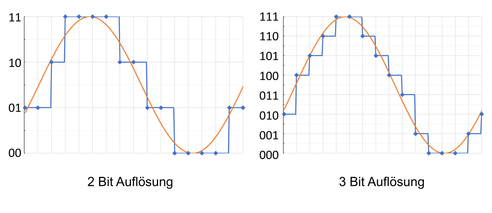
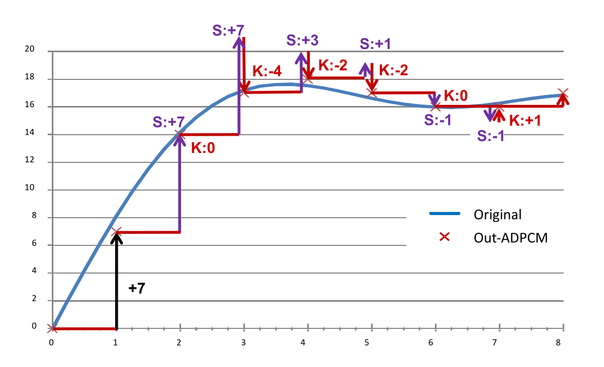
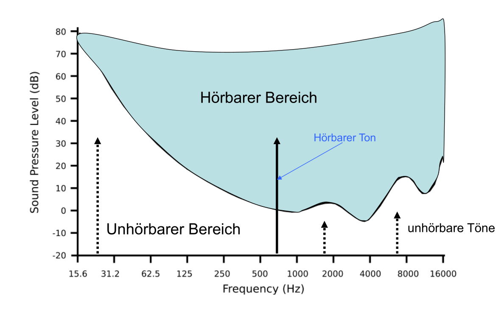
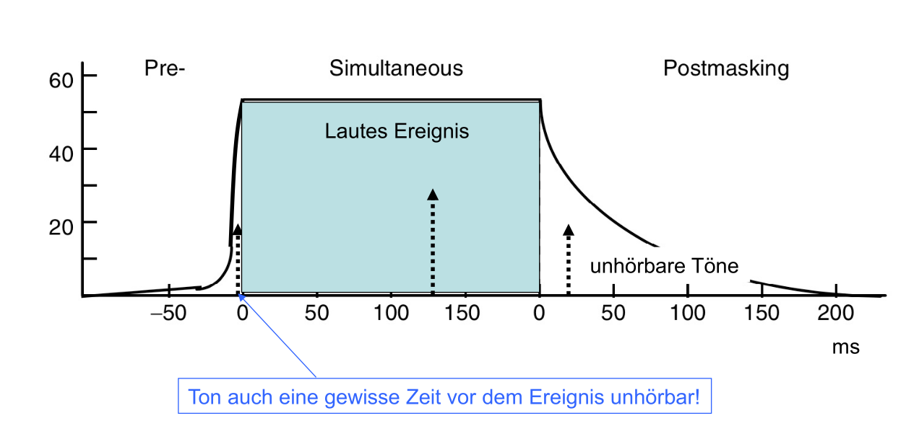
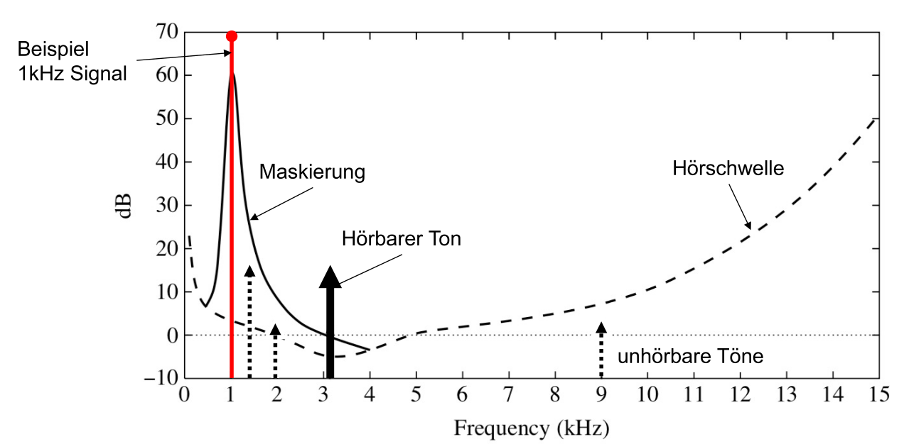
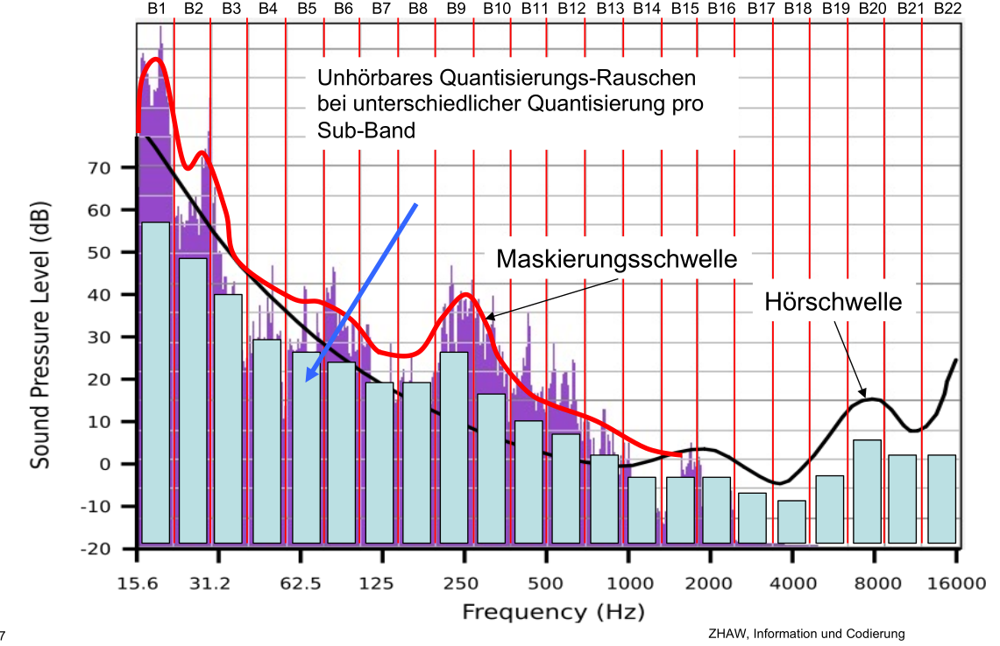
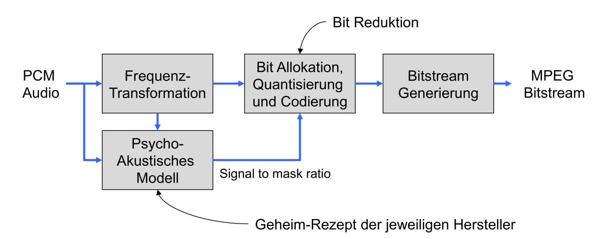

# Audio

## Abtastrate

Um  ein Audio-Signal digital zu verwenden, muss man es Abtasten. Laut dem *Abtasttheorem von Shanon* muss die Abtastrate doppelt so gross sein, wie die maximale Frequenz ($f_{abtast} > 2\cdot f_{max}$). Wegen dem Abtasten wird das Signal quantisiert. 

Wenn man $2\cdot f_{max}$ übersteigt, beginnt sich die Frequenz zu spiegeln. Die hat die Frequenz $f_{abtast}-f_{zu hohe Frequenz}$

## Quantisierungsrauschen

Das Quantisierungsrauschen entsteht bei Rundungsfehler auf die nächste Zahl, welche abgespeichert weren kann.

Das Rauschen ist die Differenz zwischen dem Analogensignal und dem digitalen Signal. Das Rauschen wird durch die grüne "Kurve" dargestellt.

**Um jede erhöhung um 1 Bit nimmt das Rauschen um 6dB ab**

## Schalldruckpegel (dB)

Der Schallpegel wird mit der folgenden Formel berechnet: 

$L=20\cdot log_{10}(\frac p {p_0})$ 

* $p$ = Effiektiver Schaldruck [PA]

* $p_0$=Bezugsschalldruck 

Wie man in der Formel sieht, ist Decibel eine Logarithmischeschwelle

## Puls Code Modulation (PCM)

### ITU-T G.711 (A-law)

Der Frequenzbereicht ist 300-3400Hz und wird mit 8000Hz abgetastet. Ein Abtastpunkt werden als 8 bit gespeichert, das ergibt eine Datenrate von $8000Hz \cdot 8Bit = 64KBit/s$

### CD-Adio

Eine CD benützt eine Abtastfrequenz von 44.1kHz und speichert dies als 16-bit Wert ab. Die Datenrate ist $44'100 Hz * 2Byte * 2 Kanäle = 176'400 Byte/s=1.411 MBit/s$

Quantisiert wird Linear. Dies heisst dass die Y-Achse in einem solchen Diagram linear ist.

### Arten von PCM

PCM kann auf mehrere Arten abgespeichert werden

* Absolut: Jeder Wert wird als absoluter Wert abgespeichert

* Diffrerential-PCM (DPCM): Es werden nur die Differenzen gespeichert 

* Adaptive Differential-PCM (ADPCM): Es werden die Differenzen der Differenzen Gespeichert. Der Sinn dahinter: Bei Audio-Files ändert sich die Differenz nicht fest, also ist es effizenter nur die Differenzen der Differenzen zu speichern
  

## Linear Prediction Coder (LPC)

Das Äquivelent zu der DCT in der Audio Welt. Wird heutzutage nicht mehr verwendet.

## Wave File Format

Hier ist das Header Format von einem Wave-Files, welches PCM Daten enthält. Werte im Wave-Format sind im Little-Endian Format abgespeichert (Tieferer Wert kommt zu erst)

| Offset | Byte | Name          | Erklärung                                                    |
| ------ | ---- | ------------- | ------------------------------------------------------------ |
| 0      | 4    | ChunkID       | Contains the letters "RIFF" in ASCII form                    |
| 4      | 4    | ChunkSize     | 36 + SubChunk2Size, or more precisely:4 + (8 + SubChunk1Size) + (8 + SubChunk2Size)This is the size of the rest of the chunkfollowing this number. This is the size of theentire file in bytes minus 8 bytes for thetwo fields not included in this count: ChunkID and ChunkSize. |
| 8      | 4    | Format        | Contains the 4 letters "WAVE"                                |
| 12     | 4    | Subchunk1ID   | Contains the 4 letters "fmt "                                |
| 16     | 4    | Subchung1Size | 16 for PCM. This is the size of the rest of the Subchunk which follows this number. |
| 20     | 2    | AudioFormat   | PCM = 1 (i.e. Linear quantization) Values other than 1 indicate some form of compression. |
| 22     | 2    | NumChannels   | Mono = 1, Stereo = 2, etc.                                   |
| 24     | 4    | SampleRate    | 8000, 44100, etc.                                            |
| 28     | 4    | ByteRate      | == SampleRate * NumChannels * BitsPerSample/8                |
| 32     | 2    | BlockAlign    | == NumChannels * BitsPerSample/8 The number of bytes for one sample including all channels. |
| 34     | 2    | BitsPerSample | 8 bits = 8, 16 bits = 16, etc.                               |
| 36     | 4    | Subchunk2Id   | Contains the 4 letters "data"                                |
| 40     | 4    | Cubchank2Size | == NumSamples * NumChannels * BitsPerSample/8 This is the number of bytes in the data. You can also think of this as the size of the read of the subchunk following this number. |
| 44     | *    | Data          | The actual sound data.                                       |

## FLAC (Free Lossless Audio Codec)

* Kompressionsrate: 30-50%

* Benützt ein Verfahren ählich auf die LZ-Codierung

## MPEG

Es werden zwei Fakten des Menschlichen Gehöhres ausgenutzt:

1. die menschliche Höhrschwelle
   
   Die Höhrschwelle ist bei jedem Mensch verschieden und ändert isch auch über das Leben einer Person.
   

2. Spektrale Maskierung
   Wenn ein Lauterton abgespielt wird, werden leisere Töne unhöhrbar. Kurz bevor einem Lautenton höhrt man bereits leisse Töne nicht mehr. Dasselbe gillt auch für danach.
   

Diese zwei Fakten müssen zusammen betrachtet werden. In der Unteren Graphik sieht man, wie die beiden Effekte kombiniert wurden.

Man unterteilt das Audiosignal in mehrere Frequenzbänder. Jedes Frequenband enkodiert man mit genau so viel Bits, so dass das Quantisierungsrauschen unter der Höhrschwelle bzw. Maskierungsschwelle bleibt.  

### MP3

* Frequenzbänder in MP3: 512 (in ACC: 2048 Frequenbänder)

* Frequenz-Transformation - Adiosignal in mehrere Frequenzbänder aufteilen

* Psycho-Akustisches-Modell - Man entscheidet, wie viel bits man benötigt (siehe oben)
