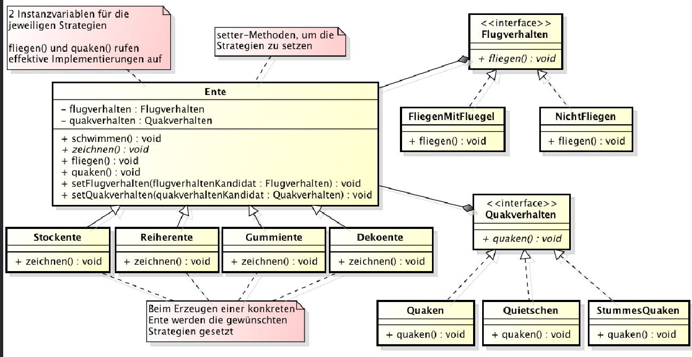

# Patterns

## Strategy Pattern

> Beim Strategy Pattern wird ein Algorithmus in eine Strategy-Klasse extrahiert. Dies erleichtert es, einen Algorithmus mit einem anderen zu wechseln.

Im folgenden Beispiel wird eine Hirachie einer Ente gezeigt. Dabei hat Ente verschiedene Methoden, welche von verschiedenen Entenarten überschrieben werden können. 

Ein Problem, dass bei einer solchen Hirarchie entstehen kann, ist dass es reduntante Implementationen von einzelnen Methoden geben kann. Als Beispiel: Die Stockente und die Reiherente können beide fliegen, während die Gummiente und Dekoente nicht fliegen können. Zwei der Klasse müssen immer `fliegen()` überschreiben.

Als Alternative kann hier das Strategy-Pattern genutzt werden. Nun hat die Ente-Klasse Referenzen zu Strategy-Implementationen, welche entscheiden, ob eine Ente fliegen oder nicht fliegen kann. So kann duplizierter Code verhindert werden

