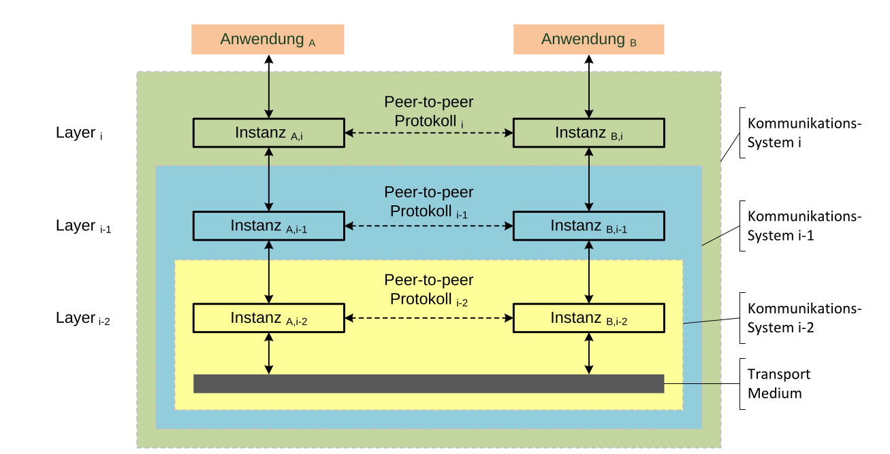
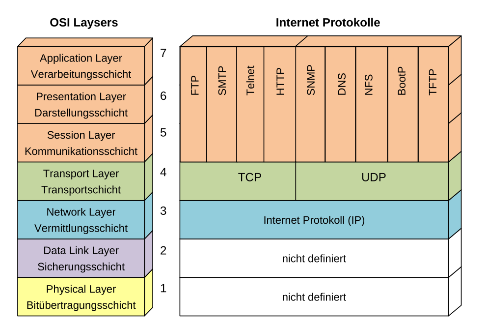
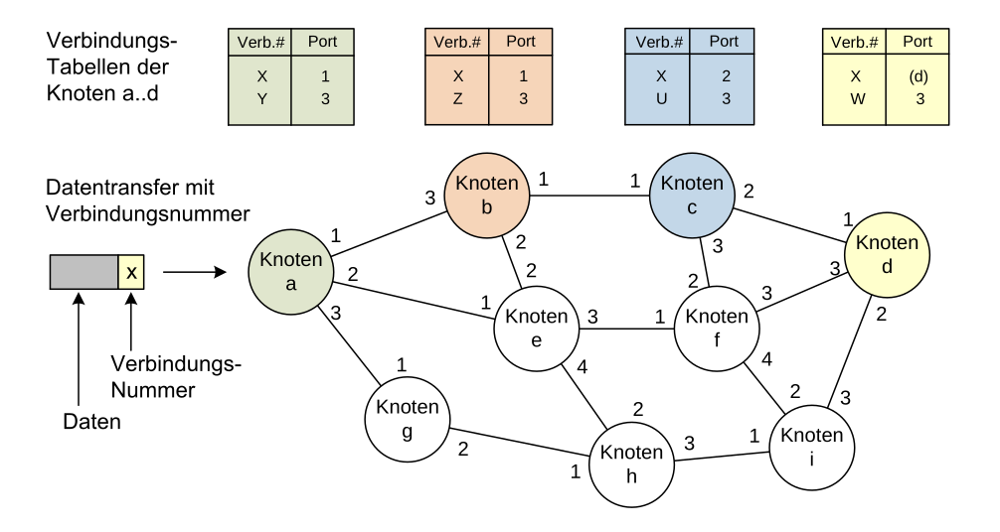
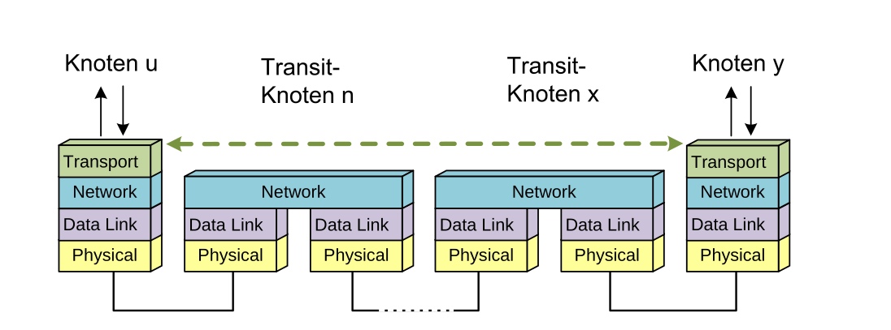

# OSI-Modell

Die Schicht $i-1$ bietet der höhreren Schicht $i$ einen Dienst an, während die Schicht $i$ eine Schnittstellen oder Service Access Protocol (SAP) implementiert. Wenn sich die Schnittstelle/Dienst ändert, hat dies auswirkungen auf die Schichten darum herum. Das Protokoll einer Schicht kann allerdings geändert werden, da dies nur von derselben Schicht bei der anderen Anwendung benützt wird. 

Ein Protokol legt das Format und die Bedeugng von Nachrichten, welche zwischen denselben Schichten ausgetauscht werden.

Die Schicht 1-4 wird übllicherweisse vom OS abgedeckt. Die Schichten 5-7 werden oft zusammen gefasst als eine.

Daten werden von jeder Schicht bearbeitet und an die nächste Schicht weitergegeben. Wenn ein Packet verschickt wird, werden die Daten zuerst vom Layer 7 zum Layer 1 verpackt und beim Empfänger vom Layer 1 wird bis zum Layer 7 enpackt.

## Physical Layer (Bitübertragungsschicht)

Das physikalische Medium, was die Geräte verbindet. Dies kann ausgetauscht werden und die anderen Schichten bleiben umbetroffen.

## Data Link Layer (Sicherungsschicht)

Stellt eine sichere Verbindung den höhreren Schichten zu verfügung. 

Dieser Layer muss folgendes sicherstellen:

* sichere Verbindung zwischen zwei Punkten. Dafür braucht es Massnahmen zur Fehlererkennung und Fehlerkorrektur
* Datenblöcke vom Network Layer werden verpackt, um die Funktionalität des Layers sicherzustellen
* Fluss-Steuerung, dass der Sender nicht schneller sendet, als es der Empfänger verstehen kann

Wenn an das Übertragungsmedium mehr als zwei Teilnehmer angeschlossen sind, muss der Layer zusätzlich auch noch:

* Jeder Teilnehmer adressieren. Hierbei werden die MAC-Adressen verwenden (IP-Adressen werden vom Layer 3 verwendet)
* Steuerung des Zugriffs auf das Medium. Wenn mehrere Teilnehmer auf das Medium zugreifen können, muss definiert werden, wann, wer darf.

### Kommunikations-Art

Je nachdem wie das Übertragungsmedium aufgebaut ist, ist die Art der Kommunikation verschieden:

* Simples: Es ist nur einen Kanal in eine Richtung vorhanden (Radio, TV)
* Half-Duplex: Es ist nur ein Kanal vorhanden. Dieser wird aber abwechslungsweise genutzt (einfaches Funkgerät)
* Full-Duplex: Es sind für beide Richtungen ein Kanal vorhanden (Telefon)

##  Network Layer (Vermittlungsschicht)

Dieser Layer stellt sicher, dass das Packet vom Sender zum Empfänger durch ein Netzwerk von Konten gesendet werden. Dafür gibt es eine netzweite eindeutige Layer 3 Adressierung (IPv4 oder IPv6 im Fall des IP-Protokolls), wie auch ein Verfahren, mit welchem eine Route durchs Netzwerk gefunden wird.

### Verbindungsorientierter Dienst

In einem verbindungsoritentierem Netzwerk Layer wird eine Verbindung für ein (oder mehrere) Packete aufgebaut. Durch diese Verbindung können Daten gesendet werden, welche in derselben Reihenfolge ankommen, wie sie gesendet werden. Nach dem alle Daten gesendet wurden, muss die Verbindung wieder abgebaut werden.

Um dies zu bewerkstelligen kann jedes Paket mit einer Verbindungs-Nummer ausgestattet werden. Anhand dieser, wissen die Knoten im Netzwerk zu welcher Verbindung das Paket gehört und wohin es gesendet werden muss.

Es gibt Verbindungen, welche permantent stehen. Diese werden Permanent Virtual Circuit (PVC) genannt. Eine Verbindung, welche jedes mal aufgebaut und danach abgebaut wird, nennt sich Switched Virtual Circuits (SVC).

Diese Art von Dienst wird bei Provider Backbones mit dem Multi Protocol Label Switching (MPLS) Protkoll verwendet.

#### Fragen

* Wie wird diese Pfad gefunden?

### Verbindungsloser Dienst

Bei einem verbindungsloser Dienst wird die Zieladresse mit jedem Paket mit geschickt. Wie bei z.B. der Post gibt es keine Garantie in welcher Reihenfolge die Pakete ankommen. 

Jeder Knoten im Netzwerk muss das Netzwerk verstehen und wissen, wohin ein Paket gesendet werden muss, damit es beim Empfänger ankommt. Dafür gibt es Routing-Tables, in welchen diese Informationen stehen. 

Wenn sich das Netzwerk ändert, kann es sein, dass ein Paket ein anderen Weg zum Ziel nimmt.

Ein typisches Beispiel ist das IP-Protokoll.

### Vorteile und Nachteile

* Bei einem verbindungsorientiertem Dienst muss zuerst eine Verbindung aufgebaut werden, während bei einem verbindungsloser Dienst spontan ein Paket gesendet werden kann
* Da eine Verbindung bei einem verbindungsorientiertem Dienst aufgebaut wird, können geforderte Eigenschaften, wie Latenz oder Durchsatz, eingehalten werden. Bei einem verbindungslosem Dienst können diese Eigenschaften von Paket zu Paket anders sein.
* Verbindungsorienterte Dienste können Verkehrsströme gezielt lenken und so das Netzwerk verteilter auslasten
* Verbindslose Dienste können von selbst eine andere Route benützten, wenn eine Route ausgelastet oder unterbrochen ist
* Die Reihenfolge muss bei einem Verbindungslosem Dienst durch den Transport Layer sicher gestellt werden.

## Transport Layer (Transportschicht)

Die Aufgabe des Transport Layers ist es, die benötigte Qualität des Netzwerks sicher zu stellen. Wenn die Layer 1-3 unzuverlässig arbeiten, muss der Transport Layer diese Zuverlässigkeit wiederherstellen. Wenn die Reihenfolge darauf ankommt und dies nicht von den unteren Layers sichergestellt wird, dann wird dies zur Aufgabe des Transport Layers. Das heisst auch, dass der Transport Layer auf die unteren und oberen Schichten abgestimmt werden muss.

Im Transport Layer gibt es nur noch der Sender und den Empfänger. Die weiteren Konten werden von den Layers 1-3 abstrahiert und werden daher von dem Transport Layer nicht mehr benötigt.

Zwei wichtige Layer 4 Protokolle sind User Data Protocol (UDP), welches ein verbindungsloser, unsicherer Dienst sicherstellt und das Transmission Control Protocol (TCP), welches eine verbindungsorientierter sicherer Dienst sicherstellt.

## Session Layer (Kommunikationsschicht)

Der Session Layer stellt eine sichere Verbindung bereit. Wenn der Transport Layer zusammen bricht, ist es die Aufgabe des Session Layers, diese Verbinung wieder aufzubauen und es für die Layers weiter oben, so auszusehen zu lassen, als ob nichts passiert wäre.

## Presentation Layer (Darstellungsschicht) 

Die Aufgabe des Presentations Layers ist es, die Informationen des Applikations Layers in eine neutrale Form zu bringen.

Ein Beispiel wäre Unicode oder ASCII.

## Applikations Layer (Verarbeitungsschicht)

Der Applikations Layer ist das Bindeglied zwischen dem Netzwerk und der Anwendung. 

Beispiele wären:

* File Transfer Protocol (FTP)
* Simple Mail Transfer Protocol (SMTP)
* Hyper Text Transport Protocol (HTTP)
* Domain Name System (DNS)
