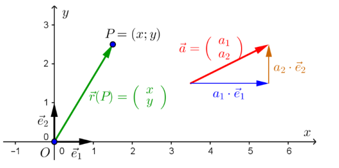
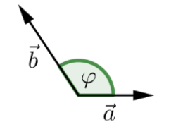
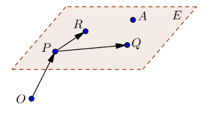
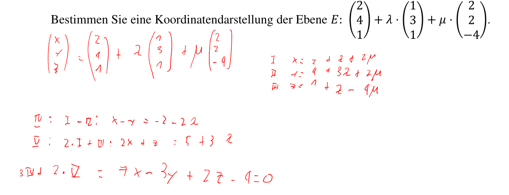
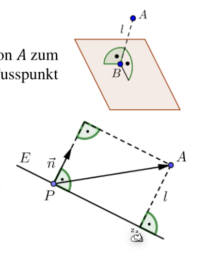

# Vektoren

[TOC]

> **Vektor**
> Ein Vektor wird durch seine Richtung und Betrag definiert (**Nicht aber der Ort**)
> 
> **Nullvektor**
> Ein Nullvektor $\vec 0$ hat den Betrag `0` und hat keine Richtung
> 
> **Einheitsvektor/normierter Vektor**
> Ein Vektor $\vec e$ oder $\vec e_a$, welchen der Betrag `1` hat und kann folgendermassen berechnet werden: $\vec e_a=\frac{\vec a}{\vert a \vert}$
> 
> **Gegenvektor**
> Der Gegenvektor zum Vektor $\vec a$ ist $-\vec a$. Es ist also ein Vektor welcher parallel zu $\vec a$ ist, denselben Betrag hat, aber in die entgegengesetzte Richtung zeigt.

## Addition

Wenn zwei Vektoren addiert werden, werden sie graphisch aneinander gehängt.

Diese Operation ist kommutativ und assoziativ:

## Skalare Multiplikation

Wenn ein Vektor mit einer Zahl multipliziert wird, wird der Vektor gestreckt, bzw. geschrumpft. Oft wird der Faktor als griechischen Buchstaben ausgedrückt, um Verwechslung zwischen Vektoren und Faktoren zu vermeiden.

## Linearkombination

Eine Linearkombination ist das kombinieren von mehreren skallierten Vektoren:
$$
\lambda_1\cdot\vec a_1+\lambda_2\cdot\vec a_2+...+\lambda_n\cdot\vec a_n
$$

## Betrag

Der Betrag eines Vektores ist seine Länge. 
$$
\begin{align}
\left\vert\begin{pmatrix}x\\y\end{pmatrix}\right\vert&=\sqrt{x^2 + y^2}\\ 
\left\vert\begin{pmatrix}x\\y\\z\end{pmatrix}\right\vert&=\sqrt{x^2 + y^2+z^2}\\
\end{align}
$$

## Kollinear

Zwei Vektoren sind kollinear, wenn es eine Gerade gibt, zu der beide parallel sind. Mathematisch kann dies als $\vec a = \lambda\cdot\vec b$ ausgedrückt werden

## Komplanar

Drei Vektoren heissen komplanar, wenn es eine Ebene gibt, zu der alle drei parallel sind.

## Linear (Un)abhängig

Vektoren werden linear unabhängig genannt, wenn es nur eine Möglichkeit gibt, mit einer Linearkombination den $\vec 0$ zu bekommen.
$$
\lambda_1 \cdot \vec a_1+\lambda_2\cdot \vec a_2 +...+\lambda_n\cdot \vec a_n=\vec 0
$$
Diese Definition ist kompatible mit Komplanar und Kollinear.

Wenn nur ein Vektor $\vec v$ gegeben ist, welcher ungleich $\vec 0$ ist, ist dieser linear unabhängig. Der $\vec 0$ ist linear abhängig.

Wenn $\vec a$ und $\vec b$ linear unabhängig sind, dann ist $\begin{vmatrix}a_x & b_x\\ a_y & b_y\end{vmatrix}\neq 0$. Wenn der Determinant nicht ausgerechnet werden kann, kann man sich überlegen, ob zwei Vektoren vielfaches voneinander sind, über den Rang oder über ein lineares Gleichungssystem. 

Ein weiterer Tip: in $\R^m$ können maximal $m$ Vektoren linear unabhängig sein. Wenn es mehr Vektoren sind, können sie **nicht** linear unabhängig sein.

Eigenschaften:

* $\det(A)\neq 0$
* $\Leftrightarrow$ Spalten sind linear unabhängig
* $\Leftrightarrow$ Zeilen sind linear unabhängig
* $\Leftrightarrow rg(A)=n$
* $\Leftrightarrow$ A ist regulär, bzw. invertierbar
* $\Leftrightarrow A\cdot \vec x=\vec 0$ ist eindeutig lösbar   

### Satz 1

Es lässt sich der Vektor $\vec c$ als Linearkombination der Vektoren $\vec a$ und $\vec b$ im 2D-Raum darstellen, wenn

* $\vec a$, $\vec b$ und $\vec c$ komplanar zueinander sind
* $\vec a$ und $\vec b$ nicht kollinear sind

### Satz 2

Wen drei Vektoren $\vec a$, $\vec b$ und $\vec c$ nicht komplanar sind, lässt sich jeder Vektor $\vec d$ in $\R^3$ als eine Linearkombination von $\vec a$, $\vec b$ und $\vec c$ darstellen

## Kordinaten-System

Ein Kordinaten-System im Raum $\R^2=R\times R$ hat folgendes:

- Ein Punkt $O$ als Ursprung
- Ein Einheitsvektor $\vec e_1$
- Ein zweiten Einheitsvektor $\vec e_2$, welcher 90° im Gegenurzeigersinn zu $\vec e_1$ ist

Jeder Vektor in diesem Kordinatensystem kann als Linearkombination von $\vec e_1$ und $\vec e_2$ gebildet werden.

Ein Kordinaten-System im Raum $R^3$ hat folgenedes:

- Einen Punkt $O$ als Ursprung
- Einen Einheitsvektor $\vec e_1$ (typischerweisse kommt dieser aus dem Display)
- Einen zweiten Einheitsvektor $\vec e_2$, welcher druch eine 90° Drehung gegen den Urzeigensinn von $\vec e_1$
- Einen dritten Einheitsvektor $\vec e_3$, welcher ortogonal (Rechtwinlig) zu $\vec e_1$ und $\vec e_2$ ist

## Ortsvektor

Ein Ortsvektor ist ein Vektor, welcher im Ursprung festgeheftet wurde.
$$
\vec r(P)=x\cdot \vec e_1+y\cdot \vec e_2=\begin{pmatrix}x\\y\end{pmatrix}
$$
Der Ortsvektor $\vec r(P)$ ist der Vektor vom Ursprung zum Punkt $P$. Dies wird zum Teil auch als $\vec{OP}$ dargestellt

## Vektor zwischen zwei Punkten

$$
\vec{PQ}=\begin{pmatrix}x_Q-x_P\\y_Q-y_P\end{pmatrix}=\vec r(Q)-\vec r(P)
$$

## Skalar Produkt

$$
\vec a \cdot \vec b = \vert \vec a \vert \cdot \vert \vec b\vert \cdot \cos(\varphi)\\
\vec a \cdot \vec b=a_1b_1+a_2b_2+a_3b_3
$$
Ein Speziallfal ist, wenn $\vec a$ oder $\vec b$ den Nullvektor $\vec 0$ ist. In diesem Fall ist das Skalarprodukt $0$.

Da es zwei Definition für das Skalarprodukt gibt, können diese gleichgesetzt werden und nach dem Zwischenwinkel afugelöst werden.
$$
\varphi =cos^{-1}\left(\frac{\vec a \cdot \vec b}{|\vec a|\cdot |\vec b|}\right)
$$

| Skalarprodukt Resultat | Winkel |
| ---------------------- | ------ |
|                        |        |
|                        |        |
|                        |        |

## Senkrechte Projektion

$$
\vec b_a =\frac{\vec a \cdot \vec b}{|\vec a|^2}\cdot \vec a\\
|\vec b_a|=\frac{|\vec a \cdot \vec b|}{|\vec a|}
$$

## Vektorprodukt

$$
\vec a \times \vec b \in \R^3\\
|\vec a \times \vec b| = |\vec a|\cdot |\vec b|\cdot \sin(\varphi)\\
...
$$

Das Vektorprodukt ist nur für Vektoren im Raum $\R^3$ definiert.

## Gerade als Vektoren

Eine Gerade kann folgendermassen dargestellt werden: $\vec r(P)+\lambda\cdot \vec {PQ}$, wobei $\vec r(P)$, ein Ortsvektor ist, $\lambda$ ein beliebiger Faktor und $\vec{PQ}$ ein Richtungsvektor, welcher die Richtung der Gerade anzeigt.

### Wie stehen zwei Vektoren zu einander

### Abstand eines Punktes zu einer Gerade

**TODO**

## Projektion von einem Vektor auf einen anderen

**TODO**

## Koordinatendarstellung von Geraden

Die Geradendarstellung $\vec r(P)+\lambda\cdot \vec{PQ}$ kann umgestellt werden in $ax+bx+c=0$. Dies kann auch gelesen werden als, alle Punkte $P(x, y)$, welche diese Gleichung erfüllt, ist auf der Gerade.

Eine Gerade kann nur in $\R^2$ in der Koordinatendarstellung dargestellt werden. 

## Normalvektor

Der Normalvektor einer Gerade ist einfach aus der Koordinatendarstellung zu lesen. Die Gerade $ax+bx+c=0$ hat den Normalvektor $\pmatrix{a\\b}$. Dieser steht orthogonal (rechtwinklig) auf der Geraden

### Umformen von Parameterdarstellung zu Koordinatendarstellung

Um eine Gerade in der Parameterdarstellung in die Koordinatendarstellung um zu wandeln, müssen die $\lambda$,  $\mu$ und co. eliminiert werden. Dafür kann man quasi den "Gauss" anwenden.
$$
g:\pmatrix{x\\y}=\pmatrix{7\\1}+\lambda\cdot \pmatrix{-2\\-4}\\
\text{Aus dieser Paramterdarstellung kann nun folgendes Gleichungssystem gebaut werden:}\\
\begin{align}
x &=7 -2\cdot \lambda \tag 1\\
y &= 1 -4 \cdot \lambda \tag2 \\
2\cdot(1)-(2): 2x-y -13 &= 0
\end{align}
$$

### Umformen von Koordinatendarstellung zu Parameterdarstellung

Um von der Koordinatnedarstellung in die Parameterdarstellung einer Gerade zu wechseln, müssen zwei Punkte auf der Gerade gefunden werden. Von diesen kann die Form $g: \vec r(P)+\lambda\cdot \vec{PQ}$ gebildet werden.

Um zwei Punkte aus der Koordinatendarstellung zu lesen, hilft es, die $x$ oder $y$ auf  `0` zu setzen und der andere Parameter zu ändern bis `0` erreicht wird.

## Darstellung einer Ebenen

### Parameterdarstellung von Ebenen

Eine Ebene kann mit drei Punkten beschrieben werden: $E: \vec r(P)+\lambda \cdot \vec{PR}+\mu\cdot \vec{PQ}$, dabei sind $\lambda$ und $\mu$ beliebige Zahlen. Der Punkt $P$ heisst Aufpunkt, die Vektoren $\vec{PR}$ und $\vec{PQ}$ heissen Richtungsvektoren.

### Koordinatendarstellung von Ebenen

Die Koordinatendarstellung einer Ebenen ist definiert als: $E: ax+by+cz+d=0$.  Die Variablen $a$, $b$ und $c$ bestimmen die Ausrichtung der Ebene. Die Variable $d$ verschiebt die Ebene parallel.

Die Koordinatendarstellung heisst normiert, wenn $|\vec n|=1$ (der Normalvektor) ist.

### Normalvektor einer Ebene

Aus von einer Ebene kann der Normalvektor berechnet werden. Dieser steht senkrecht auf der Ebene und ist folgendermassen definiert: $\vec n=\pmatrix{a\\b\\c}$

Wenn wir nicht die Koordinatendarstellung haben, sondern die Parameterdarstellung $E: \vec{r}(P)+\lambda \cdot \vec a+\mu\cdot\vec b$, dann ist $\vec n = \vec a \times \vec b$.

### Umrechnung von Parameterdarstellung zu Koordinatendarstellung

Die Umrechnung der Parameterdarstellung zur Koordinatendarstellung einer Ebene funktioniert gleich, wie bei der Gerade. Der einzige Unterschied ist, dass es drei Gleichungen statt zwei hat.

Eine zweite Art, wie dasselbe bewerkstelligt werden kann, ist über den Normalvektor. Wenn man den Normalvektor einer Ebene weiss, kann davon sehr einfach die Koordinatendarstellung abgelesen werden. Ebenfalls ist bekannt, dass der Normalvektor senkrecht/orthogonal auf der Eben steht. Mit diesen Informationen kann folgende Gleichung abgeleitet werden:
$$
E: \pmatrix{2\\4\\1}+\lambda\cdot\pmatrix{1\\3\\1}+\mu \cdot \pmatrix{2\\2\\-4}\\
\vec n=\pmatrix{1\\3\\1}\times \pmatrix{2\\2\\-4}=\pmatrix{-14\\6\\-4}\\
E: -14x+6y-4z+d=0\\
\text{Nun muss noch P eingesetzt werden, um d zu bestimmen:}\\
-14\cdot 2 + 6\cdot 4 -4\cdot 1+d=0\Rightarrow d = 8\\
E: -14x + 6y - 4z + 8 = 0
$$

### Umrechnung von Koordinatendarstellung zu Parameterdarstellung

Wie bereits bei der Gerade, müssen drei Punkte auf der Ebenen gefunden werden. Dies ist am einfachsten, wenn ein Parameter auf `0` gesetzt wird und die anderen entsprechend verändert werden, dass das Ergebnis `0` ergibt.

### Liegt ein Punkt auf einer Ebene

Wenn überprüft werden soll, ob ein Punkt auf einer Ebene liegt, kann die Parameterdarstellung einfach dem Punkt gleichgesetzt werden. Wenn es für diese Gleichung einen Wert für $\lambda$ und $\mu$ gefunden werden kann, dann ist der Punkt auf der Ebene.

Bei der Koordinatendarstellung müssen Werte für $a$, $b$, $c$ und $d$ gefunden werden, damit die Form $ax+by+cz+d=0$ stimmt.

### Liegt eine Gerade auf einer Ebene

**TODO**

1. Parameterform gleichsetzten
2. Ebene Koordiatenform, Gerade parameterform. Punkt von Gerade allgemein ausdrücken und danach in der Koordiatenform der Ebenen einsetzten

### Wie Ebenen zu einander stehen

Ebenen können entweder identisch, parallel oder schneidend zu einander stehen.

#### Parallel

Wenn überprüft werden soll, ob zwei Ebenen $E$ und $F$ parallel zu einander sind, muss überprüft werden, ob die beiden Richtungsvektoren von $E$ komplanar zu den Richtungvektoren von $F$ sind. 

Wenn die Koordinatenformen der Ebenen gegeben sind, müssen entweder ein Faktor $p$ für folgende Gleichungen gefunden werden.

Beispiel: 
$$
E: a_1x+b_1y+c_1z+d_1=0\\
F: a_2x+b_2y+c_2z+d_2=0
$$
In diesem Fall muss es ein Faktor $p$ geben, für welche gilt:
$$
a_1=a_2\cdot p\\
b_1=b_2\cdot p\\
c_1=c_2\cdot p\\
d_1\neq d_2\cdot p
$$
Eine weitere Möglichkeit ist, dass die Normalvektoren ausgerechnet werden können. Diese stehen Senkrecht auf der Ebene $E$. Der Normalvektor von $F$ koolinear zu dem von $E$ ist, dann sind die Ebenen parallel.

#### Identisch

Wenn überprüft werden soll, ob zwei Ebenen identisch sind und sie in der Koordinatensform gegeben sind, muss folgendes gültig sein (die letzte Gleichung ist anderst):
$$
a_1=a_2\cdot p\\
b_1=b_2\cdot p\\
c_1=c_2\cdot p\\
d_1=d_2\cdot p
$$

#### Schneidend

Wenn zwei Ebenen schneidend sind und sie gleichgesetzt werden, dann kommt dabei eine Geradegleichung heraus. Bei der Koordinatenform müssen die Gleichungen der beiden Ebenen in dasselbe Gleichungssystem eingefügt werden, bei der Parameterform müssen die Gleichungen gleichgesetzt werden.
$$
E: x-2y+2z-1=0\\
F: 2x-3y-z+2=0
$$
Diese zwei Gleichungen können in folgendes Gleichungssystem umgewandlet werden:
$$
\begin{align}
x-2y+2z&=1\\
2x-3y-z&=-2
\end{align}
$$
Daraus kann mit dem Gaus nach $x$, $y$ und $z$ gelöst werden:
$$
\left(
\begin{array}{ccc|cr}
1 & -2 & 2 & 1\\
2 & -3 & -1 & -2    
\end{array}
\right) \Rightarrow
\left(
\begin{array}{ccc|cr}
1 & 0 & -8 & -7\\
0 & 1 & -5 & -4    
\end{array}
\right)\\
\\
\begin{align}
x&=-7+8\lambda\\
y&=-4+5\lambda\\
z&=\lambda\\
\end{align}
$$

Aus diesen Gleichungen kann die Parameterform abgeleitet werden: $\pmatrix{x\\y\\z}=\pmatrix{-7\\-4\\0}+\lambda\cdot\pmatrix{8\\5\\1}$

### Abstand von Punkt zu Ebene

Um den Abstand $l$ zu berechnen, wird ein beliebiger Punkt $P$ gewählt. Danach wird der Vektor $\vec{PA}$ auf den Normalvektor $\vec n$ projiziert. Die Länge dieser Projektion ist $l$.
$$
\text{Wenn die Ebene nicht normiert sind: } l=\frac{|ax_A+by_A+cz_A+d|}{|\vec n|}\\
\text{Wenn die Ebene normiert ist: } l=|ax_A+by_A+cz_A+d|
$$
In der Formel obenen kommen $x_A$, $y_A$ und $z_A$ von den Koordinaten von $A$ und $a$, $b$ und $c$ von der Koordinatenform der Ebene.
