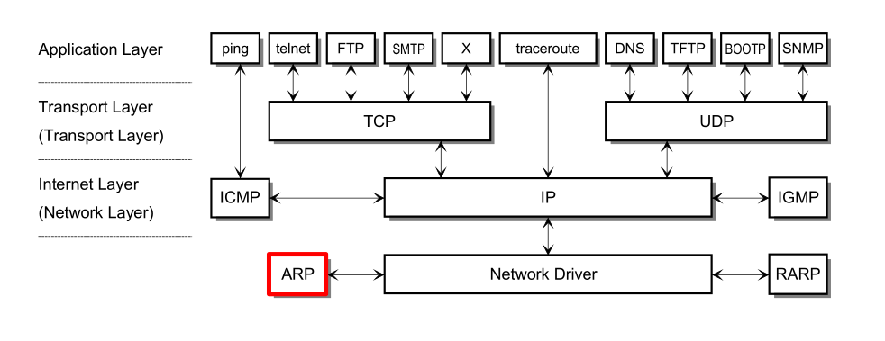
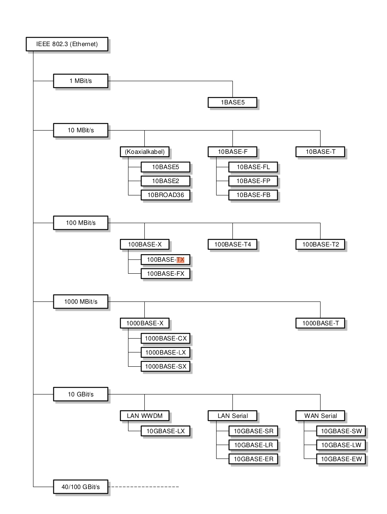
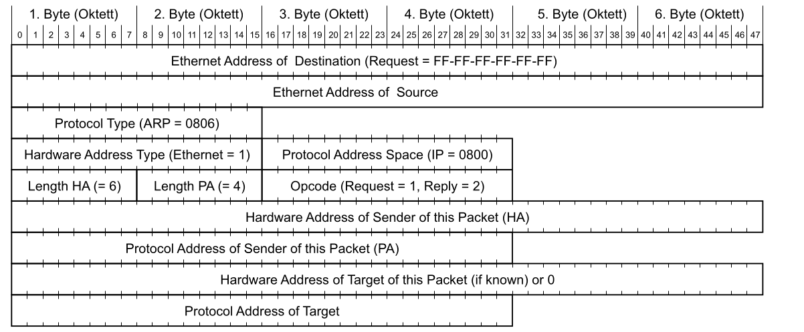
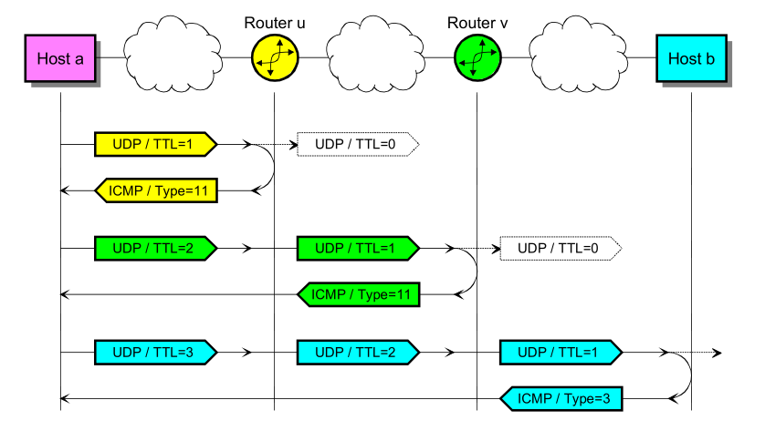
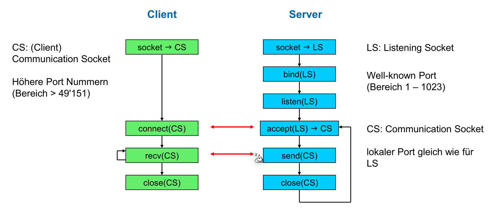
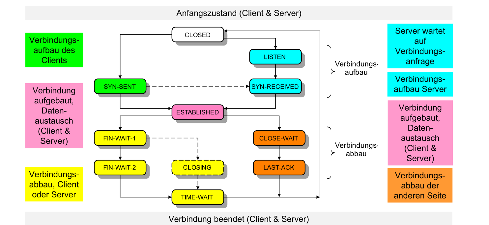
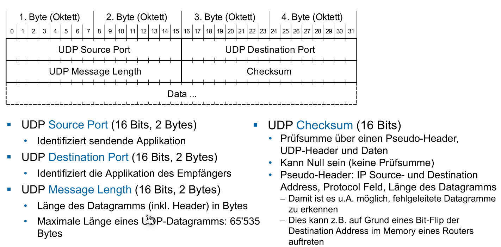

# Summary

| Hex  | Dez  | Bin  |  Hex |  Dez |  Bin |
| :--- | :--- | :--- | ---: | ---: | ---: |
| 0    | 0    | 0    |    8 |    8 | 1000 |
| 1    | 1    | 1    |    9 |    9 | 1001 |
| 2    | 2    | 10   |    A |   10 | 1010 |
| 3    | 3    | 11   |    B |   11 | 1011 |
| 4    | 4    | 100  |    C |   12 | 1100 |
| 5    | 5    | 101  |    D |   13 | 1101 |
| 6    | 6    | 110  |    E |   14 | 1110 |
| 7    | 7    | 111  |    F |   15 | 1111 |




## Physical Layer (Bitübertragungsschicht) (Layer 1)

Das physikalische Medium, was die Geräte verbindet. Dies kann ausgetauscht werden und die anderen Schichten bleiben umbetroffen.


### Formeln

| Begriff                                     | Erklärung                                                    |
| ------------------------------------------- | ------------------------------------------------------------ |
| Baud-Rate                                   | Anzahl Symbole pro Sekunde. Ein Symbol ist ein Zustand im Datenstrom |
| Bitrate (Nyquist)                           | $f_s \le 2B$ Dabei ist$f_S$ die Baud-Rate und $B$ die Bandbreite des Kanals in Hz |
| Frame-Rate $F$                              | $F=\frac B {(7+1+6+6+2+P+4+12)\cdot 8}=\frac B {38\cdot 8 + P\cdot 8}$ Die Anzahl Ethernet-Frames pro Sekunde (wobei $P$ die Payload-Bytes ist) |
| Nutz Bitrate $N$                            | $N=F\cdot P=\frac{P\cdot 8 \cdot B}{38\cdot 8 + P \cdot 8}$ - Die Bitrate, welche für Daten nutzbar ist |
| Delay von Store-Forwards Switch $t_{delay}$ | $t_{delay}=t_{frame}=\frac{Framesize}{Bitrate}$ - Wie lange das Senden eines Frames benötigt |
| Transfer Delay $t_{transfer}$               | $t_{transfer}=\frac d {C_{wire}}$, wobei $d$ die Distanz ist und $C_{wire}$ Lichtgeschwindigkeit im Kabel ist. Wie lange die Daten im Transfer sind |
| Zeichenrate                                 | $\frac{Bitrate}{Bits/Zeichen}$: Wieviel Zeichen pro Sekunde durch die Leitung passen |
| Zustände                                    | $M=1+\frac A {\Delta V}$  wobei gilt: $A$ ist die max. Amplitude $\Delta V$ die Ungenauigkeit des Empfängers |
| Max Bitrate (Hartley's Gesetzt)             | $R [bit/s] \le 2B [Hz] \cdot \log_2(M)$, wobei $R$ die max. Bitrate und $M$ die Anzahl Zustände ist |
| Informationsgehalt (Bit)                    | $\log_2(M)$ Der Informationsgehalt eines Symboles ($M$ = Anzahl Symbole) |
| Kanalkapazität ($C$)                        | $C=B\cdot \log_2\left(1+\frac S N\right)$, wobei $B$ die Kanal-Bandbreite in Hz ist, $S$ die Signalleistung und $N$ die Rauschleistung |
| Nettobitrate                                | $Nettobitrate=Brutobitrate\cdot\frac{Nutzdaten}{Nutzdaten + Header}$ |
| Hamming-Distanz                             | **TODO**                                                     |

Beispiel: Mit AMI können 3 Werte pro Symbol übertragen werden. Informationsgehalt: $I_S=\log_2(3)=1.58 \left[\frac{Bit}{Symbol}\right]$ , da aber nur ein Bit pro Symbol übertragen wird, liegt die Effizienz bei $\frac 1 {1.58}=63\%$

### Physik - Ausbreitungsgeswindigkeit

Die Lichtgeschwindigkeit im Glas mit dem Brechungsindex $n=1.5$ ist: $c_{Glass}=\frac{c_0}{n}=\frac{299'792'458}{1.5}\approx200'000\frac{km} s$ In einem elektrischen Leiter ist es ebenfalls $200'000\frac{km}s$

### Signaldämpfung


Die Dämpfung ist $Signaldämpfung [dB] = 10\cdot \log\left(\frac {P1}{P2}\right)=20\cdot \log\left(\frac {U1}{U2}\right)$, Dabei ist $P$ die Leistung und $U$ die Anzahl Spannung (Volt).

Die Dämpfung von 6dB heisst eine Leistungsabnahme von 4 und eine Spannungsabnahme von 2

Der **Dämpfungsbelag** ist wieviel Dämpfung über 100m oder 1km statfindet (Masseinheit: `db/100m` oder `db/km`)

### Kabel-Arten

#### Koaxialkabel

Bestehen aus einem Leiter und sind geeignet für hochfrequente Signale, haben einen kleinen Dämpfungsbelag und sind unempfindlich gegenüber von elektromagnetischen Störungen. Die Kabel selbst sind dafür relative empfindlich.

#### Paarsymetrische Kabel (Twisted Pair)

Das Namensschema von Twisted Pairs ist wie folgt: $xx/y\text{TP}$.

| Werte für $xx$ | Werte für $y$           | Erklärung                     |
| -------------- | ----------------------- | ----------------------------- |
| U              | U                       | ungeschirmt                   |
| F              | F                       | Folienschirm                  |
| S              | S                       | Geflechtschirm                |
| SF             | *&lt;gibt es nicht&gt;* | Schirm aus Geflecht und Folie |

*Schirme funktionieren nur, wenn sie gut geerdet sind!*

* Störsignale werden minimiert, in dem auf zwei Kabeln das invertierte gesendet wird. 
* Für Elektromagnetische Ströungen, sind die Kabel verdrillt. So heben sich die Störungen auf
* Zudem werden noch die Leitung geschirmt. Diese Schirme müssen geerdet sein und galvanisch getrennt sein

##### CAT-Kabel

| Bezeichung | Frequenzberreich | Erklörung                                                    |
| ---------- | ---------------- | ------------------------------------------------------------ |
| CAT-1-4    | 0.4/4/16/20 MHz  | Für Telefone und Modemleitungen oder langsames LAN           |
| CAT-5      | 100 MHz          | Weitverbreitet. Erlaubt eine max. Bitrate von 1000Mbit/s bis zu 100m |
| CAT-6      | 250 MHz          | Wird meistens für Gigabit (1000 Mbit/s) benützt              |
| CAT-7      | 600 MHz          | Geeigent für 10 Gigabit.  Es werden aber S/FTP Kabel benötigt |
| CAT-8      | 2000 MHz         | Datenraten bis 40 Gigabit bis zu 30m                         |

### Glassfasser

Vorteile von Glassfasser: 

* Vollstänstig unempfindlich gegenüber elektromagnetischen Störungen
* Kleine Signaldämpfung und grosse Distanzen
* Grosse Bandbreite und somit grosse Übertragunsraten

**TODO**

### Serial vs Parallel

Bei der **paralleln** Übertragung werden mehrere Signale aufsmal übertragen. Bei hohen Takten müssen alle Leitungen genau Lange sein und daher kommt es nur auf kurze Distanzen zum einsatz.

Bei serieln Verbindungen wird zuerst das LSB (= Least Significant Bit) übertragen und zuletzt das MSB (=Most Significant Bit)

Bei der **synchronen serieln** Übertragung wird ein Clock-Signal übertragen. Es werden daher keine Start- und Stop-Bits benötigt

Bei der **asynchroner serieln** Übertragung wird kein Clock-Signal übertragen. Anstatt gibt es ein Start und Stop bit. Wenn der Empfänger das Start-Bit erhält. stellt er seine eigene Clock auf diese Zeit ein. Der Takt darf nicht mehr als die halbe Bitzeit T abweichen.


### Gleichspannungsfreei

Der Sende rund Empfänger sind galvanisch getrennt. Dies schützt die Geräte, falls beim anderen ein Blitz einschlägt. Da hierbei oft mit Capacitors umgesetzt wird, sollte das Signal nicht immer bei `1` oder `0` sein, sonder möglicht oft wechseln.

### Codierungen

Bei der **AMI-Codierung** wird ein `0` als `0V` encodiert und `1` abwechslungsweise als `U+` und `U-`

Bei der **HDB3** Codierung wird zusätzlich nach `000` eine `1` mit demselben Pegel wie die letzte `1` gesendet (`0001` ist grün in der Grafik) . Wenn die Anzahl `1` seit der letzten Regelverletztung gerade ist, wird anstelle `1001`  (rot in der Grafik) versendet

 

#### Manchester-Codierung (10Mbit/s)

In Ethernet wird die Manchester-Codierung zwischen 0V und -2V angewendet.

* Eine steigene Flanke ist eine `1`
* eine sinkende Flanke ist eine `0` 


#### NRZI-Codierung (Non Return to Zero, Invert on Ones)

Diese Codierung wird bei 100BASE-TX verwendet. Bei einer `0` bleibt der Pegel, bei einer `1` wechselt der Pegel.


## Data Link Layer (Layer 2)

Aufgaben:

* Sichere Verbindung zwischen zwei Teilnehmer (Fehlerkorrektur und erkennung)
* Verpacking der Daten in Frames (Framing)
* Frame Erkennung
* Flow-Controll (Fluss Steuerung)
* Adresseriung der Teilnehmer (wenn mehrere Teilnehmer im Netz sind)
* Medium Zugriff (wenn meherere Teilnhemer das Medium teilen)

### Framing - synchrone und asynchrone Übertragung

* **asynchroner Übertragung**
  Es wird ein Frame (Anzahl Elemente; Datenblock mit $n$ Elementen; Fehlererkennung) gesendet und danach ist Ruhe, bis zum nächsten Frame
* **synchroner Übertragung**
  Es wird kontinuierlich Frames gesendet, falls nötig auch leere. Es gibt ein Start- und End Flag (meist `01111110`). Es wird **bit-stuffing** verwendet, um zu verhindern, dass das Flag im Daten-Block vorkommt. Wenn 5x`1` gesendet wurde, wird eine `0` gesendet, welche vom Empfänger ignoriert wird

### Länge eines Frames

$Nettobitrate=Brutobitrate\cdot\frac{Nutzdaten}{Nutzdaten + Header}$

Je länger ein Frame ist, desto höher ist die Nettobitrate. 
Nachteile: **Durchsatz** (Wahrscheinlichkeit, dass ein Fehler während eines Frames auftritt); **Effizienz** (Wenn ein Fehler auftritt, ist das es verloren); **Zuverlässigkeit** (Wahrscheinlichkeit, dass ein undetektierbarer Fehler auftritt steigt); **Jitter** (Variation der Zeitabstände zwischen Frames)


Durchsatz hängt von der Nettobitrate und der Frame-Fehlerwarscheinlichkeit ab
$$
\text{Frame-Erfolgswahrscheinlichkeit: } (1-p_e)^N\\
\text{Frame-Fehlerwahrscheinlichkeit: } 1-(1-p_e)^N\\
\text{Optimale Frame-Länge: } \sqrt{\frac{H}{p_e}}\\
$$
Dabei ist $N$ die Länge des Frames, $H$ die Länge des Headers und $p_e$ die Bitfehlerwahrscienlichkeit.

## Fehlererkennung

* Backward Error Correction: Fehler kann erkennt werden und die Daten neuangefordert werden
* Forward Error Correction: Die Fehler können erkennt und zu einem gewissen Punkt korrigiert werden

**Blockcodes**:

* Das Hamming-Gewicht=die kleinste Anzahl `1` auf einer Linie der Generator-Matrix
  Das Hamming-Gewicht ist gleich die Hamming Distanz $d_{min}$
* Erkennbare Fehler: $d_{min}-1$ und korrigierbare Fehler: $\frac{d_{min}-1}2$

## Fehlerkorrigierende Codes

$\frac {d_{min}-1}2$ korrigierbar


Generatormatrix Bedinungen:

1. für $d_{min}=3$ muss jeder Code (ausser dem 0-Code) min. 3x`1` haben
2. Mindestens eine `1` muss in der Einheitsmatrix sein
3. Jede Pariätsmatrix-Zeile muss 2x`1` beinhalten

### CRC

Das Datenpolynom wird um die Anzahl Stellen des Generatorpolynoms verschoben und anschliessend durch das Generatorpolynom geteilt. Das Resultat wird zum Datenpolynom hinzu addiert. Dabei werden die entstandenen `0` des Datenpolynoms gefüllt. 

Der Empfänger kann den empfangenen Wert durch das Generatorpolynom teilen und muss `0` erhalten.Flusssteuerung

## LAN

| Art       | Erklärung                                                    |
| --------- | ------------------------------------------------------------ |
| Unicast   | Ein Paket hat wird genau an ein Ziel gesendet. Das Paket wird mit einer Adresse ausgestattet, so dass es am Ziel sicher ankommt. (Netflix) |
| Broadcast | Das Paket wird an alle Knoten im Netzwerk gesendet. Das Paket wird mit einer Broadcast-Adresse ausgestattet (Live-Stream/Twitch) |
| Multicast | Das Paket wird an eine Gruppen von Knoten gesendet. (Radio)  |
| (Anycast) | Mehrere Server mit den selben Adressen. Der Knoten davor entscheidet, an welchen Knoten übertragen wird |

### Topologien

| Topologie       | Beschreibung                                                 |
| --------------- | ------------------------------------------------------------ |
| Bustopologie    | Alle Knoten sind an einer Leitung angeschlossen              |
| Linientopologie | Ein Knoten ist mit dem Nächsten verbunden.                   |
| Ringtopologie   | Eine Linientopologie, mit zusammen gefügte Enden             |
| Sterntopologie  | Alle Knoten hängen an einem Hub/Switch                       |
| Baumtopologie   | Entsteht, wenn die Sterntopologie hirarchisch kombiniert wird |

### IEEE Namensgebung

`(Bitrate in Mbit/s) (BASE|BROAD)-(Art/Medium Länge)`

* 1000BASE-T = Ethernet mit Basisband-Kanalcodierung mit einer Bitrate von 1Gbit/s mit Twisted-Pairs (T)
* 10BASE5 = 10Mbit/s Basisband-Ethernet mit max 500m (5) Segmentenlänge



### Shared-Ethernet


Bevor ein Knoten sendet, wartet er, bis die Leitung frei ist. Während dem Senden wird der Pegel auf der Leitung kontroliert, um kollisisionen fest zu stellen.

Wenn eine Kollision festgestellt wurde, wird ein Jamming Signal gesendet und ein zufälliges Vielfache von der Slot-Zeit $t_s$. Bei der 1. Kollision wird `0x` oder `1x` gewartet, bei jedem nächsten wird der Zeitbereich verdoppelt. Bis zu 16 Versuche, danach wird die Übertragung abgebrochen. Der andere Sender erkennt nur, dass ein Signal eine Kollision verursacht hat, wenn er während des Sendens ein Jamming Signal erhaltet.

### Medium Access Control (MAC)

* **Master/Slave-Verfahren**: (deterministisch) Der Master fragt zyklisch jeden Slave ab und der Slave antwortet mit den vorhanden Daten. So gibt es nie Kollisionen und das Verfahren ist deterministisch, aber der Master ist der single point of failure.
* **Token Passing**:(deterministisch) Es wird ein Token von Node zu Node Peer-to-Peer gereicht. Ein Node darf nur senden, wenn er der Token hat. Da der Token verloreren gehen kann, muss es eine Möglichkeit geben, diesen zu regenerieren. 
* **Zeitgesteuerter Zugriff**: (deterministisch) Jeder Node hat ein Sende-Slot. Mit diesem Verfahren kann eine hoche Auslastung des Netzes erreicht werden, allerdings muss jeder Node den "Fahrplan" und die genaue Zeit kennen.
* **Carrier Sense Multiple Access (CSMA)** (undeterministisch): Jeder Knoten prüft zuerst ob der Bus frei ist und sendet, wann er will. 
* **Carrier Sense Multiple Access / Collision Detection (CSMA/CD)** (undeterministisch): Zusätzlich werden Kollisionen festgestellt und danach nach einer zufälligen Zeit wieder versucht
* **Carrier Sense Multiple Access with Collision Resolutino (CSMA/CR)** (undeterministisch): Es gibt ein dominateter Pegel (1 oder 0), welcher gewinnt bei Konflikten. Nur der Verlierer kann dies allerdings feststellen und bricht die Übertragung ab.

### Collision Domain

**Collision Domain**
Die Collision Domain ist der Bereich des Netzwerks, in welchem ein Fehler erkennt wird. Da der ursprüngliche Sender nur die Kollision erkennt, wenn er das Jamming Signal während des Sendens empfängt, muss die Collision-Domain kleiner als die Halbe-Ausbreitungsdistanz des kürzesten Paket (46Bytes Daten)
$$
t_{frame} > 2\cdot t_{transfer}\\
t_{frame} = \frac{Framesize_{min}}{Bitrate} \\
t_{transfer}=\frac{d_{max}}{C_{Medium}}\\
d_{max}<\frac 1 2 \frac{Framesize_{min}}{Bitrate}\cdot C_{Medium}
$$

Dabei ist $d_{max}$ die Maximale Distanz der Collision Domain

Wenn ein Repeater/Hub im Spiel ist, muss die Formel $t_{frame} > 2\left(\sum t_{transfer} + \sum t_{forwarding}\right)$ benutzen, da der Router das eigentliche Signal, wie auch das Jamming Signal verzögert.

Die **Broadcast-Domain** ist der Bereich im Netzwerk, in welcher ein Broadcast-Frame ankommt.

### Hub vs Switch

Ein Hub ist ein "dummes" Gerät, welcher alle Informationen an alle Ports senden. Ein Switch liest die Layer 2 Headers and sendet das Paket nur an die nötigen Ports. Dadurch wird die Collision Domain unterbrochen. Dies wird auch Transparent Bridging genannt, da die Sender und Empfänger nichts davon wissen.

Ein Switch merkt sich die Mac-Adressen der Sender und speichert diese mit dem Port in der Filtering Database ab. Dank dieser Datenbank, muss der Switch ein Paket nur an einen Port senden (ausser Broadcast-Frames). Nach einer gewissen Zeit wird ein Eintrag wieder gelöscht. (**Address Learning**)

### VLAN

Bei VLAN wird ein VLAN-Tag zwischen `Source-Adress` und `Length/Type` eingefügt. Mit diesem Tag kann ein Switch ein Paket einem bestimmten Virtuellen LAN zuordnen. Diese Zuordnung wird in einer Tabelle geregelt. Ein Virtuelles Lan bildet eine Broadcast Domain.

Dieser Tag besteht aus:

* **Tag Protocol Identifier**:
* **User Priority/Priority Code Point**: (3 Bit) Eine Priorität, um z.B. gewisse Applikationen zu priorisieren
* **Cannonical Format Identifier**
* **VLAN-Identifier**: (12-Bit)

### (Rapid) Spanning Tree Protocol

Beim Rapid Spanning Tree Protocol werden einige Pfade deaktiviert, um Loops zu "entfernen".

Es muss ein Root-Switch im Baum gefunden werden. Der Root ist der Switch mit der tiefsten Bridge Identifier. Falls zwei die gleiche Haben, entscheided die Mac-Adresse. 

Zu begin preist jeder Switch sich selbst als Root-Switch an. Übernimmt aber ein anderen Root-Switch, sobald er eine Nachricht erhaltet, in welchem ein "besseren" Root-Switch erwähnt wird. In diesen Bridge Protocol Data Unit (BPDU) Nachrichten teilt jeder Switch seinen Nachbarn mit, welches nach seiner Wissen, der nächste Root-Switch ist und wie viel der Weg dorthin kostet. Der **Root-Port** eines Switches ist der Port, über welcher der Root-Switch über den kürzesten Weg erreichbar ist. 

Alle Bridges senden BPDU-Nachrichten all 2 Sekunden. Falls diese Ausbleiben, wird das Netzwerk neu konfiguriert.

### Mac-Adresse

`04-0A-E0-13-14-26`

Im ersten Byte (oben `04`) `0000 00xy`, ist $x$, ob es eine Group Adress (`1`) oder individual Address (`0`) ist und $y$, ob es eine Locally administered Address (`1`) oder Universally adinistered address (`0`) ist.

Die ersten 3 Bytes ist die ID der Hersteller, die letzten 3 Bytes eine Laufnummer (`aa-aa-aa-bb-bb-bb`, a ist die ID des Herstellers, b die Laufnummer)

### Ethernet Frame

* **Preamble** und **Start Frame Delimiter (SFD)**

  Die Preamble werden 7 Bytes, welche aus Abwechslungsweise `0` und `1` bestehen. Das 8 Byte (das SFD) hat die Form `10101011`

* **Length/Type**
  Wenn der Wert $\le 1500$ ist, stellt es die Anzahl von Bytes im `Data` Feld dar (ohne `PAD`). Sonst wird angegeben, was für ein höheres Protokoll im Datenfeld enthalten ist. 0x8100 (=33024) ist der VLAN-Tag Typ

* **Data/PAD**
  Die Daten (zwischen 0 - 1500 Bytes). Falls die Daten kleiner als 46 Bytes sind, wird dies mit PAD aufgefüllt

* **Frame Check Sequence**
  CRC32 Checksume

* **Interframe Gap**
  minimaler zeitlichen Abstand zwischen zwei Frames

## Network Layer (Layer 3)

Die **Aufgabe** des Layer 3 ist es die Kommunikation zwischen zwei Konten bereit zu stellen. Dies soll möglich sein, unabhängig von den Layern 1 und 2. Daher wird eine netzweite Adressierung (IP-Adressen) benötigt.

Grob kann der Layer 2 in **verbindungsorientierte ** Dienste und **verbindungslose Dienste** unterteilt werden. Ein verbindungsorientierter Dienst muss zuerst eine Verbindung aufbauen und kann sich wie ein Schlauch vorgestellt werden. Alle Daten gehen durch diesen Schlauch. 

Ein verbindungsloser Dienst funktioniert wie die Post.

| Klassen | Adressbereich               | Anzahl Netze | Interfaces pro netz |
| ------- | --------------------------- | ------------ | ------------------- |
| A       | 1.0.0.0 - 127.255.255.255   | 127          | 16'777'214          |
| B       | 128.0.0.0 - 191.255.255.255 | 16'384       | 65'534              |
| C       | 192.0.0.0-223.255.255.255   | 2'097'152    | 254                 |

Die folgenden privaten Netzwerke gibt es:

| Klasse     | Netzadresse                   | Subnetmaske   |
| ---------- | ----------------------------- | ------------- |
| A          | 10.0.0.0                      | 255.0.0.0     |
| B          | 172.16.0.0 - 172.31.0.0       | 255.255.0.0   |
| C          | 192.168.0.0 - 192.168.255.0   | 255.255.255.0 |
| APIPA-Netz | 169.254.1.0 - 169.254.244.255 | 255.255.0.0   |

Anzahl addressierbare Hosts: $2^{(32 - subnet)} - 2$ (für "/24" $2^{(32-24)}-2=2^8-2=254$)

Die **Netzadresse** ist die tiefste Adresse, die **Broadcast-Adresse** ist die höchste Adresse

### IP Header


* **Version** (4 Bit)
  Gibt die Version des IP-Headers an. Es ist somit möglich mehrere IP-Version (IPv4 oder IPv6) zu betreiben.

* **Internet Header Length (IHL)** (4 Bit) 
  Gibt die Länge allen Headers an. Der gelesene Wert wird mit dem Faktor 4 multipliziert. Wenn also 5 gelesen wird, sind die Headers 20 Bytes lang. IHL muss zwiscehn 5 (20 Bytes) und 15 (60 Bytes) sein. Der fixe Teil eines IP-Headers sind 20 Bytes, also bleiben 40 Bytes für Optionale Felder.

* **Type of Service** (8 Bit)
  Gibt an, was für eine Art von Leitung es ist. Ein Sender kann danach entscheiden, ob er eine Leitung, welche eine hoche Bandbreite hat, dafür ein schlechten Ping (wie eine Satelitenverbindung) oder lieber eine "normale" Glassfasserleitung benützt. Dies wurde nie von allen Service-Providern unterstützt.

* **Total Length** (16 Bit)
  Die totale Länget des IP-Paketes mit Headers  und Daten. 

* **Identifiaction** (16 Bit)
  Ein Wert, welches ein Paket eindeutig identifiziert. Dieser Wert wird benützt, um fragmentierte Pakete wieder zu einem Paket zusammen zusetzen.

* **Flags** (3 Bit)
  Beinhaltet Kontrollflags für die Fragmentierung

  | Feld | Position | Wert | Funktion               | Erklärung                        |
  | ---- | -------- | ---- | ---------------------- | -------------------------------- |
  |      | Bit 0    |      | reserved, must be zero | Reserviert, immer Null           |
  | DF   | Bit 1    | 0/1  | May / Don't Fragment   | keine Fragmentierung (`1`)       |
  | MF   | Bit 2    | 0/1  | Last / More Fragments  | Ob ein Folgefragment kommt (`1`) |

* **Fragment Offset** (13 Bit)
  An welcher stelle ein fragmentiertes Paket in das ganze Paket gesetzt werden soll. Der gelesen Wert wird mit dem Faktor 8 multipliziert. (Aus 90 wird 720 Bytes)

* **Time to Live (TTL)** (8 Bit)
  Gibt die Anzahl Sekunden an, welche das Paket noch im Netz sein darf. Wenn der Wert 0 wird, wird das Paket verworfen. In der Praxis ist es schwierig zu messen, wie lange ein Paket unterwegs ist und daher dekrementiert der Router der Wert um `1` wenn er es weiter sendet. 
  Wenn ein Router ein Paket mit TTL=1 erhaltet, dekrementiert er es zu `0` und verwirft es.

* **Protocol** (8Bit)
  Das Protokol, welches im Datenteil übertragen wird. Folgendes sind die wichtigsten Beispiele:

  | Protocol | Keyword | Protokollbezeichnung           |
  | -------- | ------- | ------------------------------ |
  | 1        | ICMP    | Internet Control Message       |
  | 6        | TCP     | Transmission Controll Protocol |
  | 17       | UDP     | User Datagram Protocol         |

* **Header Checksum** (16 Bit)
  Eine Prüfsumme, welche nur über den IP-Header gebildet wird. Diese muss von jedem Router neu berechnet werden, da gewisse Felder vom Router modifiziert werden.

* **Source Address** (32 Bit)
  Die IP-Adresse des Senders

* **Destination Address** (32 Bit)
  Die IP-Adresse des Empfängers

* **Options und Padding** (max. 40 Bytes)
  Optionale Felder

### Maximum Transfer Unit (MTU)

Die MTU gibt an, wie viel Bytes über eine Leitung geschickt werden können. Dabei werden aber nur die Daten-Bytes des Ethernet-Frames gezählt. Die Bytes des Ethernet-Headers gelten nicht. 

### Fragmentation und Reassembly

Es gibt folgende Fälle beim Reassembly:

* Flag `MF`=0 und `Fragment Offset`=0: Es wurde nicht fragmentiert
* Flag `MF`=1 und `Fragment Offset`=0: Dies ist das erste Fragment
* Flag `MF`=1 und `Fragment Offset`>0: Dies ist ein Zwischen-Fragment
* Flag `MF`=0 und `Fragment Offset`>0: Dies ist das letzte Fragment

Reassembly wird erst beim Ziel-Host erledigt, um Routers zu entlasten und es zu ermöglichen, dass Fragmente verschiedene Pfade durchs Netzwerk nehmen könnten.

### Address Resolution Protocol (ARP) [Layer 2]


Ein ARP-Request wird als Broadcast-Message verschickt, die Antwort hingegen nicht.



Für **Requests** (Bild von oben), ist die `Ethernet-Hardware-Address` auf die Broadcast-Adresse angegeben und das Feld `Hardware Address of Traget` ist `null`, da es nicht bekannt ist.

Bei der **Reply** ist die `Ethernet Address of Destintation)` und `Hardware Address of Target` gesetzt.

In einem ARP-Cache werden die Mac-Ip Paare gecached.

Ein **Gratuitous ARP Request**   wird von einem Konten beim Booten oder Adresse-Veränderung versendet. Wenn keine Antwort zurück kommt, ist die IP-Adresse nicht vergeben. So können Adress-Konflikte erkannt werden.

Ein **Gratuitous ARP Reply** wird von Knoten beim Booten oder Adress-Verändrung versendet um den ARP-Cache anderer Knoten zu berechtigen oder setzen. Da die Reply ohne Request verschickt wurde, wird sie an die Broadcast-Adresse geschickt.

**Reverse Address Resolution Protocol (RARP)** kann genutzt werden, um von einer MAC-Adresse die IP-Adresse zu bekommen von einem zentralen Server. Z.B. von einer Maschine nach einem Reboot.


### Internet Control Message Protocol (ICMP) [Layer 3]

ICMP Pakete werden der Schicht 3 zugeordnet, obwohl sie in einem IP-Paket gekapselt werden.

| ICMP-Type | Bedeutung               | Beispiel                                                     |
| --------- | ----------------------- | ------------------------------------------------------------ |
| 3         | Destination Unreachable | Wenn der Router ein Node nicht erreiche kann, weil z.B. die MTU zu klein ist, das höhere Protokoll deaktiviert ist beim Host, das Paket fragmentiert werden muss aber DF gesetzt ist oder der Node ausgesteckt wurde:<br /><br /> **TODO Code** Protocol Unreachable=Node kommuniziert nicht über das Protokol;  Port Unreachable = Kein Program hört auf diesen Port; 13 Communication adminstrativvely prohibited = Die Firewall blockiert etwas.<br />Destination Unreachable kann auch genutzt werden, um die MTU einer Leitung zu finden |
| 4         | Source Quench           | Der Puffer des Routers ist voll                              |
| 5         | Redirct                 | Wird an ein Host geschickt, wenn der Router feststellt, dass ein Paket an den falschen Router geschickt wurde |
| 11        | Time Exceeded           | Wenn das TTL-Feld =0 ist, wird es vom Router nicht mehr weitergesendet. Dies kann für Trace-Rout genutzt weden. Jeder Router reduziert das TTL-Feld um 1. Wenn der Router ein Paket mit TTL=1 bekommt wird dies um `1` reduziert und danach verworfen. |
| 12        | Parameter Problem       | Falls der Host oder Router im IP-Header einen ungültigen Wert hat |
| 0         | Echo Reply              | Die Antowort auf ein Echo Request                            |
| 8         | Echo (-Request)         | Pingt ein Knoten an, welcher ein Echo Reply senden sollte    |
| 13        | Timestamp               | Verhalten sich gleich wie Echo-Requests/-Replies aber senden noch die Zeit des Senders und Empfängers |
| 14        | Timestamp Reply         | Siehe 13 - Timestamp                                         |

#### Destination Unreachable (Type 3)


* **Code-Feld**: 0 = net unreachable; 1 = host unreachable; 2= protocol unreachable; 3 = port unreachable; 4 fragmentation needed and DF set; 5 source route failed; 13 = communication administratively prohibited
* **Internet Header + 64 Bits of Original Datagram** enthält den ersten Teil des Datagramms,
  das die ICMP-Meldung ausgelöst hat. Damit ist der ursprüngliche Absender in der Lage, den
  Fehler genauer zu bestimmen.

#### Time Exceeded Message (Type 11)

Das Format ist gleich, wie bei Destination Unreachable (Type 3). Das **Code-Feld** kann folgende Werte haben: 0 = time to live exceeded in transit; 1 = fragment reassembly time exceeded.

#### Echo-Request/-Reply Message (Type 8 / Type 0)


* **Identifier**: ID, damit der Sender die Echo-Reply zu einem Prozess kann. In der Reply steht die selbe Zahl
* **Sequence Number**: Wird bei jedem Echo-Request inkrementiert. In der Reply steht die selbe Zahl.
* **Code-Feld**: ist null

## Transport Layer (Layer 4)

Die Aufgabe des Layer 4 ist es eine effiziente Verbindung zwischen zwei Knoten für den Session Layer (Layer 5) zu bereit stellen.  Dabei soll die Qualität der Verbindung gewährgeleistet sein

### Adressierung

Ein Port ist eine Zahl zwischen 1 und 65'536 und sind folgendermassen unterteilt:

* **1-1023**: Well-Known Port Nummern, wie z.B. 80 für HTTP
* **1024-49'151**: Reservierte Bereiche für herstellerspezifischen Applikationen
* **49'152-65'536**: Dynamische/Private Ports, welche beliebig verwendet werden können

Die folgende Tabelle enthält die wichtigsten Well-Known Ports:


*(465/TCP - SMTPS sollte heissen "SMTP **over** SSL/TLS")*

Um eine Kommunikationsbeziehung eindeutig zu bestimmen braucht es folgende 5 Parameter: Source Port; Destination Port; Source IP-Adresse; Destination IP-Adresse; Das Protokol (UDP oder TCP)

### TCP (Transmission Control Protocol)

TCP bietet folgendes für eine Applikation:

1. **Verbindungsorientierte Übetragung**: Eine Verbindung muss zuerst aufgebaut werden und eine TCP-Verbindung hat genau 2 Endpunkte (Multicast wird nicht unterstützt)
2. **Hohe Zuverlässigkeit:** TCP garantiert die Datenübertragung ohne Verluste in der richtigen Reihenfolge
3. **Vollduplexübertragung: ** In einer TCP Verbindung können Daten in beide Richtungen fliessen
4. **Stream-Schnittstelle: ** Eine Andwenung kann ein Stream von Bytes senden, welche vom Empfänger in derselben Reihenfolge wieder empfangen werden.
5. **Zuverlässiger Verbindungsaufbau**: Es muss zuerst eine Verbindung aufgebaut werden. Pakete von einer vorherigen Verbindungen sind danach nicht mehr gültig
6. **Eleganter Verbindungsabbau**: Beide Seiten können die Verbindung trennen und sie wird sauber abgebaut

Im folgenden Diagramm wird aufgezeichnet, wie ein Verbindungsaufbau, das Senden/Empfangen von Nachrichten und der Verbindungsabbau beschreiben.



Im folgenden Diagramm sind die feinen Zustände eines Clients oder Server aufgezeichnet:



### Probleme

Die folgenden Probleme müssen von TCP gelöst werden:

* Eine Verbindung soll zuverlässig auf- und abgebaut werden können
* Eine TCP-Nachricht können **verloren, verfälscht, dupliziert oder verstauscht** werden. TCP muss diese Nachrichten trotzdem wieder korrekt zusammen setzen und der Applikationsschicht übergeben. Hierfür werden Techniken, wie Sequenznummern, Adaptiver Timeout, Sliding Window Protokoll benützt.
* Der Empfänger soll nicht überschwemmt werden. Hier für wird Flow Control mit Advertized Window Size genützt.
* Das Netzwerk dazwischen soll nicht überlastet werden. Hier für gibt es Congestion Control mit Slow Start Algorithmus.

### TCP-Header


* **TCP Source Port und Destination Port**: Der genutzte Port auf dem Sender und Empfänger
* **Sequence Number**: (Bezieht sich auf die Ausgangsdaten) Anhand dieser Zahl können Daten in der richtigen Reihenfolge der Applikation übergeben werden und es wird die Acknowledgement Number damit berechnet
* **Acknowledgment Number**: (Bezieht sich auf die Eingangsdaten) 
* **Header Length/Data Offset**: Gibt an, wo der TCP-Header mit optionalen Headers aufhört und die Daten beginnen
* **Control Bits**: Flags, welche z.B. den Verbindungsaufbau und -abbau einleiten
  
  Diese Flags haben die folgende bedeutung:
  * **URG**: Urgent-Pointer-Feld enhält einen gültigen Wert
  * **ACK**: Acknowledgment Feld enhält einen gültigen Wert
  * **PSH**: (= Push) Empfänger soll Daten sofort an die Applikation weiterleiten
  * **RST** (=Reset) Verbindung zurücksetzen
  * **SYN** (=Synchronize) Verbindung aufbauen
  * **FIN**: Der Sender hat keine Daten mehr zu übertragen. Verbindung abbauen

* **Window**: Gibt die noch verfügbare Buffer-Grösse des Senders an. Wenn ein Empfänger `0` im Window-Feld erhält, stoppt er zu senden, bis eine Retransmission mit einem grösseren Window-Feld ankommt.
* **Checksum**: Die Checksume des TCP-Pakets
* **Urgent Pointer**: Falls `URG` gesetzt ist, zeigt dieses Feld an, wo die "Urgent-Daten" im Datenblock gefunden werden können
* **Options**: Optionen, wie "SACK" oder die maximale Segmentlänge (MSS) können als optionale Option übertragen werden

### Verbindungsaufbau


### Datenaustausch

Eine Nachricht vom Sender müssen vom Client immer mit einem Paket, welches das `ACK`-Flag Gesetzt hat, bestätigen werden. Vor dem senden startet der Sender ein Timer. Falls dieser abläuft, bevor der Empfänger das Paket bestätigt hat, wird das Paket erneut versendet. Es gibt eine **Retransmission**.

Die `Seq` Zahl der Antwort des Servers ist die `Ack` Zahl des Requests. Die `Ack` Zahl der Antwort des Servers ist die `Seq`-Zahl + die Anzahl empfangenen Bytes.


### Verbindungsabbau


MSL=Maximum Segment Length

Das Timeout am Ende ist nötig, falls das letzte `ACK b+m+1` nicht ankommt. In diesem Fall würde die Passive-Seite noch mals ein `FIN b+m` Paket senden.

### Sliding Window


### Adaptive Elemente von TCP

#### Adaptives Timeout

Das Timeout von TCP wird adaptiv bestimmt und ändert sich über die Lebenszeit der Verbindung.

Dafür werden folgende Formeln benützt:
$$
RTO_n=SRTT_n + 4\cdot RTTVAR_n\\
SRTT_n = (1 - \alpha )\cdot SRTT_{n-1}+\alpha\cdot RTT_n\\
RTTVAR_n=(1 - \beta)\cdot RTTVAR_{n - 1}+\beta \cdot \vert SRTT_n - RTT_n \vert
$$

 Dabei steht $RTO$ für `Retransmission Time-Out`, $SRTT$ für `Smoothed Round-Trip-Time` und ist ein gewichteter Mittelwert, $RTT$ für `Round-Trip-Time` und $RTTAV$ für `Round-Trip-Time Variance` und ist der gewichteter Mittelwert der Abweichung, bzw. die Streuung.

Wenn die Roud-Trip-Time überschritten wird, wird der Sender das Paket erneut senden.

#### Bestätigung von Paketen

In TCP wird das Sliding-Window Verfahren für die Bestätigung von Paketen genützt. Der Sender sendet alle Pakete im Fenster und schiebt das Fenster weiter, wenn die älteste Nachricht bestätigt wurde.

Ohne Sliding-Window Verfahren muss der Sender immer auf eine Bestätigung warten. Mit dem Sliding-Window können mehrere Pakete versendet werden.

#### Fluss-Steuerung

Im folgenden Paket wird angenommen, dass der Empfänger mit einer Buffergrösse von 2'500 Bytes hat. Der Empfänger sendet die verbleibende Buffergrösse im `Window` Feld zurück. Wenn der Sender eine Bestätigung mit `Window=0` empfängt, wartet er, bis er dieselbe Bestätigung mit einer höheren `Window` Feld empfängt.


#### Überlastung des Netzwerks vermeiden

Beim Slow-Start Algorithmus beginnt der Sender mit einer kleinen vordefinierten Grösse und verdoppelt dies mit jedem gesendetem Paket bis er die erste Schwelle erreicht. Danach wird die Paketgrösse linear vergrössert bis ein Timeout entsteht. 

Bei einem Timeout wird die nächste Schwelle auf die Hälfte des Paketes, bei welchem das Timeout entstand. Danach wird wieder ein Slow-Start ausgeführt.


Es gibt für den Slow-Start Algorithmus folgende Kritikpunkte

* Die "Sägezahnkurven" verschiedener TCP-Sessions tendieren dazu, sich zu synchronisieren
* Die Annahme gilt für Wireless-Netze nicht mehr unbedingt, wo relativ viel Paketverlust durch Bitfehler
  während der Übertragung vorkommt
* Slow-Start bei kurzen Transfers immer slow (www)
* Abhängig von Round Trip Time

## UDP (User Datagram Protocol)

UDP, wie auch TCP, ist ein Layer 4 Protokol und benützt Ports zur adressierung. Es ist aber nicht zuverlässig und erledigt nichts gegen Paket Verluste oder vertauschte Pakete.

### Header

Der UDP Header besteht aus 8 Bytes und beinhaltet folgendes:



## Application Layer (Layer 7)

### DNS (UDP/53)

| Type  | Beschreibung                                                 |
| ----- | ------------------------------------------------------------ |
| A     | IPv4 Adresse des gesuchten Hosts (32 Bit)                    |
| AAAA  | IPv6 Adresse des gesuchten Hosts (128 Bit)                   |
| MX    | Mail Exchange (Mail Server)                                  |
| NS    | Name Server für eine Zone                                    |
| CNAME | Canonical Name; Alias zum Host                               |
| TXT   | Text Record; in Antowrten für verschiedenste Angaben verwendet |

Die 13 **Root Server** wissen wo die NS-Server der Top-Level Domains sind.

#### Ablauf einer Namensauflösung

**Resolver** ist die lokale Software.

1. Host fragt DNS-Server nach einer Adresse `hello.example.com.`
2. DNS Server fragt Root-Server nach dem `com.` NS
3. DNS Server fragt `.com`-NS nach `example.com.`
4. DNS Server fragt `example.com.`-NS nach `hello.example.com`

Für **Reverse DNS** werden dieselben Schritte ausgeführt, aber mit einer IP Adresse. 

###  DHCP / BOOTP (UDP/67; UDP/68)

Der Client fragt den Server nach einer Konfiguration auf dem UDP Port 67 als Broadcast-Nachricht. Die Antwort wird an die MAC-Adresse des Client gesendet. BOOTP funktioniert auch über Netzwerk-Grenzen. Dabei ist der Router so konfiguriert, dass er den BOOTP-Request liest und per Unicast an den BOOTP-Server sendet. Die Antwort wird wieder an den Client zurück geleitet.

Es werden folgende Infos gesendet:

* Netzwerk Configuration: IP-Adresse; Subnet; Gateway IP
* Boot File Name

Nachteile von BootP sind: 

* Bei grossen Anzahl von Knoten, möchte man IP-Adressen gemeinsam nutzen, was mit BootP nicht praktikabel ist
* Mehraufwand, da für jeden Knoten eine Konfiguration eingetragen werden muss

DHCP ist abwärtskompatibel mit BootP.

### Network Address Translation (NAT)

Wenn ein Paket gesendet wird, wird die Source-Adresse und ev. den Port durch die des Gateways ersetzt und an den Server weitergeleitet. Anhand des Ports kann der Gateway eingehende Pakete unterscheiden und dem korrekten Client senden. Dafür wird wieder der Header modifiziert.

Probleme von NAT:

* OSI-Model wird verletzt, da die IP und Port verändert werden und auch Checksummen neu gerechnet werden müssen
* Die Verbindung kann nicht auf Layer 1-3 Verschlüsselt werden, da die Informationen vom Gateway benötigt werden

### Autoconfiguration mit IPv4 - Automatic Private IP Addressing (APIPA)

Wenn kein DHCP-Server gefunden wird, wird eine zufälle IP-Adresse zwischen 169.254.1.0 bis 169.254.244.255 (Netzwerk 169.254.0.0/16) gewählt und mit einem Gratuious ARP-Request überprüft, ob die IP-Adresse bereits besetzt ist.

Um mit dieser IP-Adresse ins Internet zu kommen, muss der Router ARP-Requests für alle IP-Adressen ausserhalb des Netzwerks erkennen und auf sich leiten. Der Router kann die Pakete danach an den korrekten Host weiterleiten.

Um Geräte ohne DHCP und DNS Server zu finden, kann multicast DNS (mDNS) verwendet werden, welches ein verteilter DNS Server ist. Es wird ein "normalen" DNS Request an `244.0.0.251` mit dem UDP Port 5353 geschickt. Wenn nach `services.dns-sd.udp.local.` gefragt wird, antworten alle mDNS fähigen Geräte.

### Trivial File Transfer Protocol (TFTP) [UDP/69]

Es gibt fünf Operationen:

* **Read Request (RRQ)**: Fordert eine Datei an
* **Write Request (WRQ)**: Shickt eine Datei an den Host
* **Acknowledgment (ACK)**: Bestätigt das korrekte Empfangen von WRQ- oder DATA-Pakete. Es wird die Block-Nummer angegeben
* **Data (DATA)**: Übermittelt die eigentlichen Daten-Blöcke. Ein Block ist 512 Bytes (wenn nicht anderst angegeben in WRQ oder RRQ Request). Wenn ein Block kleiner ist, wird das als Ende der Datei interpretiert.
* **Error (ERROR)**: Beschreibt den aufgetretener Fehler

Wird ein ACK oder DATA Paket nicht innerhalbs einer Zeit empfangen, wird die letzte ACK- oder DATA Nachricht nochmals versendet.

### Simple Mail Transfer Protocol (SMTP) [TCP/25]

Sendet ein Mal zu einem Mail-Server, welcher das Mail ebenfalls weiterleitet oder zwischen Speichert damit der Nutzer dies via POP3 oder IMAP abholen kann.

Ablauf:

1. Verbinden mit dem Server und identifizieren und authentifizieren
2. Client sendet `MAIL FROM <absender>` und `RCPT TO <empfänger>` um die Empfänger zu definieren
3. Mit `DATA` wird das Mail versendet
4. `QUIT` wird vom Client gesendet, was vom Server mit `Bye-Bye` quitiert wird

Der Server-Antwortet auf die Befehle mit 3-stelligen Zahlen Codes (wie HTTP-Status Codes)

```smtp
S: 220 mail.zhaw.ch ESMTP Sendmail 8.8.8/8.8.8
C: HELO zhaw.ch
S: 250 mail.zhaw.ch Hello mth@mail.zhaw.ch, pleased to meet you
C: MAIL FROM:<mth@zhaw.ch>
S: 250 OK
C: RCPT TO:<kls@zhaw.ch>
S: 250 <kls@zhaw.ch>... Recipient ok
C: DATA
S: 354 Enter mail, end with "." on a line by itself
C: Date: 06 Jan 2099 16:34:25 +0100
C: To: kls@zhaw.ch
C: Subject: Test einer Mail.
C:
C: Damit ist der SMTP-Teil beendet.
C: .
S: 250 OK
C: QUIT
S: 221 mail.zhaw.ch closing connection
```

#### Zeichensatz

SMTP benützt ein 7-Bit ASCII Zeichen-Satz.

Folgende Headers werden gesetzt, um MIME zu verwenden. Der Mime-Seperator wird eingesetzt wenn

```smtp
MIME-Version: 1.0
Content-Type: Multipart/Mixed;
Boundary="Mime-Separator-WAB02622.926626671"

Mime-Separator-WAB02622.926626671
Content-Type: text/plain
Hallo! Hier folgt der Text.


```

#### Quoted-Printable

Jedes 8-bit Zeichen wird durch `=xx` ersetzt, wobei `xx` eine Hex-Zahl ist. (`1` -> `=31`). Dies ist sehr ineffizient (Effizienz: 30%)

#### Base64


Alle Texte werden auf 6-Bit Zeichen aufgeteilt. Wenn es nicht aufgeht, wird mit `=` ein (6-Bit) null-Byte eingesetzt. Ausdem folgt, das ein Vielfaches von drei 8-Bit Bytes kein Padding benötigten. (Effiizienz: 73%)

