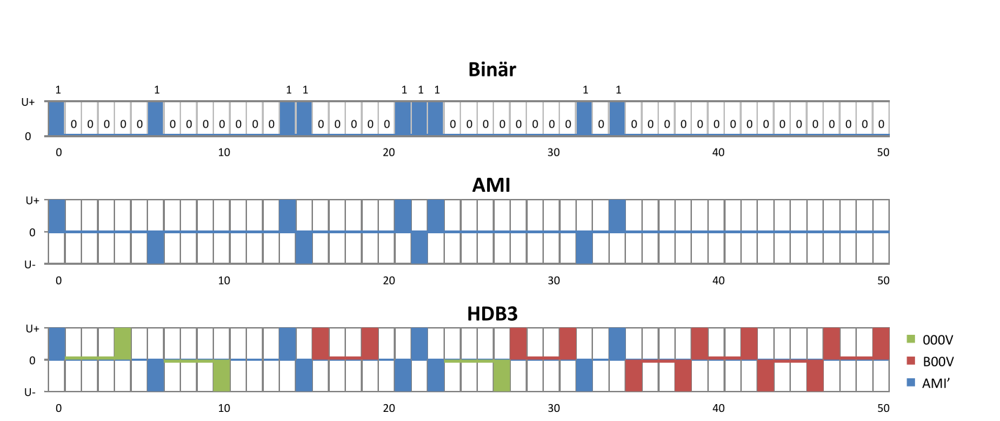

# Summary

## Physical Layer (Bitübertragungsschicht) (Layer 1)

Das physikalische Medium, was die Geräte verbindet. Dies kann ausgetauscht werden und die anderen Schichten bleiben umbetroffen.

### Physik - Ausbreitungsgeswindigkeit

Die Lichtgeschwindigkeit im Glas mit dem Brechungsindex $n=1.5$ ist: $c_{Glass}=\frac{c_0}{n}=\frac{299'792'458}{1.5}\approx200'000\frac{km} s$ In einem elektrischen Leiter ist es ebenfalls $200'000\frac{km}s$

### Signaldämpfung

Die Dämpfung ist $Signaldämpfung [dB] = 10\cdot \log\left(\frac {P1}{P2}\right)=20\cdot \log\left(\frac {U1}{U2}\right)$, Dabei ist $P$ die Leistung und $U$ die Anzahl Spannung (Volt).

Die Dämpfung von 6dB heisst eine Leistungsabnahme von 4 und eine Spannungsabnahme von 2

Der **Dämpfungsbelag** ist wieviel Dämpfung über 100m oder 1km statfindet (Masseinheit: `db/100m` oder `db/km`)

### Kabel-Arten

#### Koaxialkabel

Bestehen aus einem Leiter und sind geeignet für hochfrequente Signale, haben einen kleinen Dämpfungsbelag und sind unempfindlich gegenüber von elektromagnetischen Störungen. Die Kabel selbst sind dafür relative empfindlich.

#### Paarsymetrische Kabel (Twisted Pair)

Das Namensschema von Twisted Pairs ist wie folgt: $xx/y\text{TP}$.

| Werte für $xx$ | Werte für $y$           | Erklärung                     |
| -------------- | ----------------------- | ----------------------------- |
| U              | U                       | ungeschirmt                   |
| F              | F                       | Folienschirm                  |
| S              | S                       | Geflechtschirm                |
| SF             | *&lt;gibt es nicht&gt;* | Schirm aus Geflecht und Folie |

*Schirme funktionieren nur, wenn sie gut geerdet sind!*

* Störsignale werden minimiert, in dem auf zwei Kabeln das invertierte gesendet wird. 
* Für Elektromagnetische Ströungen, sind die Kabel verdrillt. So heben sich die Störungen auf
* Zudem werden noch die Leitung geschirmt. Diese Schirme müssen geerdet sein und galvanisch getrennt sein

##### CAT-Kabel

| Bezeichung | Frequenzberreich | Erklörung                                                    |
| ---------- | ---------------- | ------------------------------------------------------------ |
| CAT-1-4    | 0.4/4/16/20 MHz  | Für Telefone und Modemleitungen oder langsames LAN           |
| CAT-5      | 100 MHz          | Weitverbreitet. Erlaubt eine max. Bitrate von 1000Mbit/s bis zu 100m |
| CAT-6      | 250 MHz          | Wird meistens für Gigabit (1000 Mbit/s) benützt              |
| CAT-7      | 600 MHz          | Geeigent für 10 Gigabit.  Es werden aber S/FTP Kabel benötigt |
| CAT-8      | 2000 MHz         | Datenraten bis 40 Gigabit bis zu 30m                         |

### Glassfasser

Vorteile von Glassfasser: 

* Vollstänstig unempfindlich gegenüber elektromagnetischen Störungen
* Kleine Signaldämpfung und grosse Distanzen
* Grosse Bandbreite und somit grosse Übertragunsraten

**TODO**

Arten der Verbindung:

* Simplex: Nur ein Kanal (TV, Radio)
* Halbduplex: Nur ein Kanal, welcher abwechslungsweise in beide Richtung nutzbar ist (Funkgerät)
* Vollduplex: Ein Kanal in beide Richtungen

### Serial vs Parallel

Bei der **paralleln** Übertragung werden mehrere Signale aufsmal übertragen. Bei hohen Takten müssen alle Leitungen genau Lange sein und daher kommt es nur auf kurze Distanzen zum einsatz.

Bei serieln Verbindungen wird zuerst das LSB (= Least Significant Bit) übertragen und zuletzt das MSB (=Most Significant Bit)

Bei der **synchronen serieln** Übertragung wird ein Clock-Signal übertragen. Es werden daher keine Start- und Stop-Bits benötigt

Bei der **asynchroner serieln** Übertragung wird kein Clock-Signal übertragen. Anstatt gibt es ein Start und Stop bit. Wenn der Empfänger das Start-Bit erhält. stellt er seine eigene Clock auf diese Zeit ein. Der Takt darf nicht mehr als die halbe Bitzeit T abweichen.

### Gleichspannungsfreei

Der Sende rund Empfänger sind galvanisch getrennt. Dies schützt die Geräte, falls beim anderen ein Blitz einschlägt. Da hierbei oft mit Capacitors umgesetzt wird, sollte das Signal nicht immer bei `1` oder `0` sein, sonder möglicht oft wechseln.

### Taktrückgewinnung

Bei der **AMI-Codierung** wird ein `0` als `0V` encodiert und `1` abwechslungsweise als `U+` und `U-`

Bei der **HDB3** Codierung wird zusätzlich nach `000` eine `1` mit demselben Pegel wie die letzte `1` gesendet (`0001` ist grün in der Grafik) . Wenn die Anzahl `1` seit der letzten Regelverletztung gerade ist, wird anstelle `1001`  (rot in der Grafik) versendet 

### Bandbreite

| Begriff                         | Erklärung                                                    |
| ------------------------------- | ------------------------------------------------------------ |
| Baud-Rate                       | Anzahl Symbole pro Sekunde. Ein Symbol ist ein Zustand im Datenstrom |
| Bitrate (Nyquist)               | $f_s \le 2B$ Dabei ist$f_S$ die Baud-Rate und $B$ die Bandbreite des Kanals in Hz |
| Zustände                        | $M=1+\frac A {\Delta V}$  wobei gilt: $A$ ist die max. Amplitude $\Delta V$ die Ungenauigkeit des Empfängers |
| Max Bitrate (Hartley's Gesetzt) | $R [bit/s] \le 2B [Hz] \cdot \log_2(M)$, wobei $R$ die max. Bitrate ist |
| Informationsgehalt (Bit)        | $\log_2(M)$ Der Informationsgehalt eines Symboles            |
| Kanalkapazität ($C$)            | $C=B\cdot \log_2\left(1+\frac S N\right)$, wobei $B$ die Kanal-Bandbreite in Hz ist, $S$ die Signalleistung und $N$ die Rauschleistung |

Beispiel: Mit AMI können 3 Werte pro Symbol übertragen werden. Informationsgehalt: $I_S=\log_2(3)=1.58 \left[\frac{Bit}{Symbol}\right]$ , da aber nur ein Bit pro Symbol übertragen wird, liegt die Effizienz bei $\frac 1 {1.58}=63\%$

## Data Link Layer (Layer 2)

Aufgaben:

* Sichere Verbindung zwischen zwei Teilnehmer (Fehlerkorrektur und erkennung)
* Verpacking der Daten in Frames (Framing)
* Frame Erkennung
* Flow-Controll (Fluss Steuerung)
* Adresseriung der Teilnehmer (wenn mehrere Teilnehmer im Netz sind)
* Medium Zugriff (wenn meherere Teilnhemer das Medium teilen)

### Framing

Bei ****
