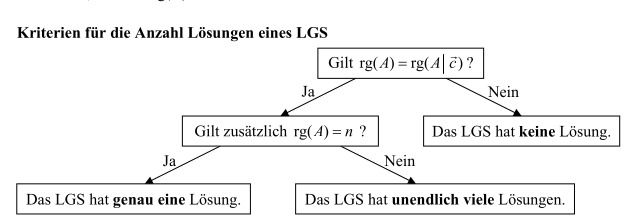
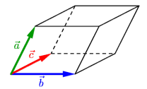

# LA Summary 

$$
\newcommand{\len}[1]{\vert #1 \vert}
$$

[TOC]

## Linearen Gleichungssysteme (LGS)

* Zeilenstufenform: Alle nicht-`0` Zeilen, haben eine führende `1`; Alle `0`-Zeilen stehen zu unterst; Je weiter unten, desto weiter rechts steht eine führende `1`
* reduzierte Zeilenstufenform: Zusätzlich gilt: Eine Spalte mit einer führenden `1`, darf nur noch `0` enthalten

### Lösung aus Zeilenstufenform

1. Unterscheiden zwischen Spalten mit führenden `1` und mit freien Unbekannten.
2. Für alle freie Unbekannte kann ein Unbekannte gleichgesetzt werden (z.B. $\lambda$)
3. Alle Zeilen mit einer führenden-`1` werden in eine Gleichung umgewandelt werden

### Lösung aus reduzierter Zeilenstufenform

Das Resultat kann abgeschaut werden.

### Lösbarkeit von LGS

**TODO**: Verbindung mit Quadratischen Matrizen/Vektorräume/...

Eigenschaften, wenn $rg(A)=n$ gilt:

* $\det(A)\neq 0$
* $\Leftrightarrow$ Spalten sind linear unabhängig
* $\Leftrightarrow$ Zeilen sind linear unabhängig
* $\Leftrightarrow rg(A)=n$
* $\Leftrightarrow$ A ist regulär, bzw. invertierbar
* $\Leftrightarrow A\cdot \vec x=\vec 0$ ist eindeutig lösbar   

## Vektoren

* **Ortsvektor**
  Ein Vektor $\vec r(P)$, welcher am Ursprung festgehaftet ist
* **Nullvektor** $\vec 0$
  Ein Vektor mit dem Betrag 0 und keiner Richtung
* **Gegenvektor**: $\vec a\rightarrow -\vec a$
* **Kollinear**:
  Wenn zwei Vektoren parallel sind oder $\vec a = \lambda \cdot \vec b$
* **Komplanar**
  Drei Vektoren heissen komplanar, wenn es eine Ebene gibt, zu der alle drei parallel sind.
* **Vektor zwischen zwei Punkten**
  $\vec{PQ}=\begin{pmatrix}x_Q-x_P\\y_Q-y_P\end{pmatrix}=\vec r(Q)-\vec r(P)$

### Linear Unabhängig

Vektoren sind linear Unabhängig, wenn es nur **eine** Möglichkeit gibt mit einer Linearkombination $\vec 0$ zu erreichen: $\lambda_1\cdot \vec a_1 + \lambda_2 \cdot \vec a_2 + ... + \lambda_n \cdot \vec a_n=\vec 0$

Eigenschaften die daraus folgen:

* $\det(A)\neq 0$
* $\Leftrightarrow$ die Inversematrix kann gebildet werden
* $\Leftrightarrow$ Spalten sind linear unabhängig
* $\Leftrightarrow$ Zeilen sind linear unabhängig
* $\Leftrightarrow rg(A)=n$
* $\Leftrightarrow$ A ist regulär, bzw. invertierbar
* $\Leftrightarrow A\cdot \vec x=\vec 0$ ist eindeutig lösbar   

### Sätze

1. **Satz 1**: Es lässt sich der Vektor $\vec c$ als Linearkombination der Vektorn $\vec a$ und $\vec b$ im **2D**-Raum darstellen, wenn
   1. $\vec a$, $\vec b$ und $\vec c$ komplanar sind
   2. $\vec a$ und $\vec b$ nicht kollinear sind
2. **Satz 2**: Es lässt sich den Vektor $\vec d$ als Linearkombinatino der Vektoren $\vec a$, $\vec b$ und $\vec c$ im **3D**-Raum darstellen, wenn $\vec a$, $\vec b$ und $\vec c$ nicht komplanar sind

### 3D-Koordinatensystem

### Skalarprodukt

$$
\vec a \cdot \vec b = \vert \vec a \vert \cdot \vert \vec b\vert \cdot \cos(\varphi)\\
\vec a \cdot \vec b=a_1b_1+a_2b_2+a_3b_3\\
\varphi =cos^{-1}\left(\frac{\vec a \cdot \vec b}{|\vec a|\cdot |\vec b|}\right)\\
\vec a \cdot \vec b = 0\Rightarrow \varphi=90°=\frac 2 \pi
$$
Folgende Gesetzte gelten:

* Kommuntativ-Gesetzt: $\vec a \cdot \vec b=\vec b \cdot \vec a$
* Distributive-Gesetzt: $\vec a \cdot (\vec b + \vec c)=\vec a \cdot \vec b + \vec a \cdot \vec c$
* Gemischtes Assoziativ-Gesetzt: $\lambda\cdot (\vec a \cdot \vec b)=(\lambda \cdot \vec a)\cdot \vec b=\vec a \cdot (\lambda \cdot \vec b)$
* $\vec a \cdot \vec a=\vert \vec a \vert ^2$

### Orthogonale Projektion

$$
\vec b_a =\frac{\vec a \cdot \vec b}{|\vec a|^2}\cdot \vec a\\
|\vec b_a|=\frac{|\vec a \cdot \vec b|}{|\vec a|}
$$

### Vektorprodukt

Folgende Gesetze gelten: 

* $\len {\vec a \times \vec b}=\len {\vec a}\cdot \len {\vec b}\cdot \sin(\varphi)$
* $\vec a \times \vec b$ ist orthogonal zu $\vec a$ und $\vec b$
* $\vec a$ und $\vec b$ sind kollinear, wenn $\vec a \times \vec b=\vec 0$ gilt
* $\vec a \times \vec a = \vec 0$
* Antikommutativ-Gesetz: $\vec a \times \vec b = -(\vec b \times \vec a)$
* Distributiv-Gesetzt: $\vec a \times (\vec b + \vec c)=\vec a \times \vec b + \vec a \times \vec c$ und $(\vec a + \vec c)\times \vec c = \vec a \times \vec c + \vec b \times \vec c$
* Gemischtes Assoziativ-Gesetz: $\lambda \cdot (\vec a \times \vec b)=(\lambda \cdot \vec a)\times \vec b=\vec a \times (\lambda \cdot \vec b)$
* Das Assoziative-Gesetzt gilt **nicht**: $\vec a \times (\vec b \times \vec c)\neq (\vec a \times \vec b)\times\vec c$
* $\vec a \times \vec b$ ist die Fläche eines Parallelogrammes aufgespannt durch $\vec a$ und $\vec b$
  

## Gerade

* **Parameterdarstellung**
  $g: \vec r(P)+ \lambda \cdot \vec{PQ}$

  * Zu Kordinatendarstellung umrechnen

    Als LGS schreiben und $\lambda$ eliminieren

* **Kordinatendarstellung** (nur in 2D)
  $g: ax+by+c=0$

  * Normalvektor $n=\pmatrix{a \\ b}$
    Normalvektor steht senkrecht auf der gerade
  * Zu Paramterdarstellung umrechnen:
    Zwei Punkte auf $g$ finden und damit $\vec{PQ}$ berechnen
  
* **Normierte Kordinatendarstellung** (Nur in 2D)
  Die Länge des Normalvektors is $0$. Um dies zu berechnen, den Normalvektor normieren (also durch die Länge des Normalvektors teilen)

### Wie stehen zwei Gerade zueinander

### Abstand eines Punktes

**TODO**

## Ebene

* Parameterdarstellung
  $E: \vec r(P)+\lambda \cdot \vec{PR}+\mu\cdot \vec{PQ}$ 
  * Normalvektor $\vec n = \vec{PR}\times \vec{PQ}$
  * Zu Koordinatendarstelung umwandeln
    * **Variante 1**
      Normalvektor $\vec n$ ausrechnen und in Koordinatenform einsetzen. 
      Daraus ergibt sich eine Gleichung mit einer Unbekannte $d$. Diese Lösen
    * **Variante 2**
      Die drei Gleichungen in einem LGS schreiben und $\lambda$ und $\mu$ eliminieren
  
* Koordinatendarstellung
  $E: ax+by+cz+d=0$
  * Normalvektor: $\vec n=\pmatrix{a\\b\\ c}$
    Normalvektor steht orthogonal auf der Ebene
  * Zu Parameterdarstellung umwandeln
    Drei Punkte auf der Ebene finden und daraus die Parameterdarstellung bilden

* Normierte Koordinatendarstellung
  Der Normalvektor $\vec n$ ist normiert (durch $\vert \vec n \vert$ geteilt)

### Wie stehen zwei Ebene zueinander

* **Parallel**: 

  * Parameterdarstellung
    Überprüfen, ob die Richtungsvektoren komplanar zu einander sind

  * Koordinatendarstellung
    Es muss ein Faktor $p$ in folgendem System geben
    $$
    a_1=a_2\cdot p\\
    b_1=b_2\cdot p\\
    c_1=c_2\cdot p\\
    d_1\neq d_2\cdot p
    $$
    Alternativ: Die Normalvektoren beider Ebenen  müssen koolinear sein

* **Identisch**

  * Parameterdarstellung
    Wenn die zwei Ebenen gleichgesetzt werden, müssen unendlich viele Lösungen, mit zwei nicht gefixte Grade, heraus kommen
  * Koordinatendarstellung:
    Für die Koordinatendarstellung muss folgendes gültig sein (die letzte Gleichung ist anderst)

  $$
  a_1=a_2\cdot p\\
  b_1=b_2\cdot p\\
  c_1=c_2\cdot p\\
  d_1=d_2\cdot p
  $$

* **Schneident**

  * Parameterdarstellung
    Wenn die zwei Ebenen gleichgesetzt werden, müssen unendlich viele Lösungen, mit einer nicht gefixte Grade, heraus kommen. Das Resultat ist eine Gerade in der Parameterdarstellung
  * Koordinatendarstellung
    Die beiden Ebenen in dasselbe Gleichungssystem tun und zu einem Gauss umwandeln ($d$ auf die andere Seite nehmen). Wenn dies aufgelöst wird, müsste eine Geradegleichung dabei herauskommen

### Abstand von einem Punkt zu einer Ebene

$$
\text{Wenn die Ebene nicht normiert sind: } l=\frac{|ax_A+by_A+cz_A+d|}{|\vec n|}\\
\text{Wenn die Ebene normiert ist: } l=|ax_A+by_A+cz_A+d|
$$

## Matrix

* **Null-Matrix**: Eine Matrix mit nur Nullen
* **Spalten-Matrix**: Eine Matrix mit nur einer Spalte. Verhält sich gleich, wie ein Vektor

Die folgenden Rechenregeln funktioniert für gleichgrosse Matrizen.

* Kommutativ-Gesetz: $A+B=B+A$ (Geht **NICHT** bei Multiplikation)
* Assoziativ-Gesetzt: $A+(B+C)=(A+B)+C$
* Distributiv-Gesetzt: $\lambda\cdot(A+B)=\lambda\cdot A + \lambda \cdot B$ 
  * Aber Achtung: $\lambda\cdot A + B\cdot \lambda$ kann **nicht** ausgeklammert werden (In könnte einfach $\lambda \cdot A$ und $B\cdot \lambda$ ausgerechnet werden)

* Distributiv-Gesetzt mit Transportierten Matrizen: 
  * $(A\cdot B)^T=B^T \cdot A^T$ (Beachte die Reihenfolge von A und B)
  * $(A+B)^T=A^T+B^T=B^T+A^T$
  * $(A-B)^T=A^T-B^T=B^T-A^T$

### Inverse Matrix

Die inverse Matrix kann von einer Quadratischen-Matrix gebildet werden, bei welcher $\det(A)\neq 0$ gilt
$$
\pmatrix{a & b\\ c & d}^{-1}=\frac 1 {ad-bc}\cdot \pmatrix{d & -b \\ -c & a}
$$

### Determinante

Wenn die Determinanten einer grösseren Matrix als 3x3 Berechnet werden soll, kann ein Verfahren nach Laplace eingesetzt werden:

1. Es wird eine feste Spalte oder Zeile gewählt

2. Nun wird nach der folgenden Formel entwickelt:
   $$
   \text{Entwicklung nach i-ten Zeilen: }\det(A)=\sum^n_{j=1} (-1)^{i+j}\cdot a_{ij}\cdot\det(A_{ij})\\
   \text{Entwicklung nach j-ten Spalte: }\det(A)=\sum^n_{i=1} (-1)^{i+j}\cdot a_{ij}\cdot\det(A_{ij})\\
   $$
   Dabei  ist $a_{ij}$, das Element an $i$-ter Zeile und $j$-ter Spalte und $A_{ij}$ die Matrix, bei welcher die $i$-te Zeile und $j$-Spalte weggelassen wurden

 

Der Determinante einer 2x2-Matrix, ist der Flächeninhalt des Parallelogrammes, wenn die Spalten als Vektoren aufgefasst werden. Der Determinante einer 3x3-Matrix ist der Volumeninhalt des Spates, von den Spalten der Matrix aufgespannt wird.

Eigenschaften:

* Einheitsmatrix haben den Determinanten $1$
* Für nxn Matrix gilt: $\det(A\cdot B)=\det(A)\cdot \det(B)$
* Für invertierbare Matrix gilt: $\det(A^{-1})=\frac 1 {\det(A)}$

Wenn:

* $\det(A)\neq 0$
* $\Leftrightarrow$ Die Spalten und Zeilen sind linear unabhängig
* $\Leftrightarrow \rg(A)=n$
* $\Leftrightarrow A$ ist invertierbar
* $\Leftrightarrow$ Das LGS $A\cdot \vec x = \vec c$ hat eine eindeutige Lösung 

## Vektorräume

## Lineare Abbildung

## Rest Klassen

