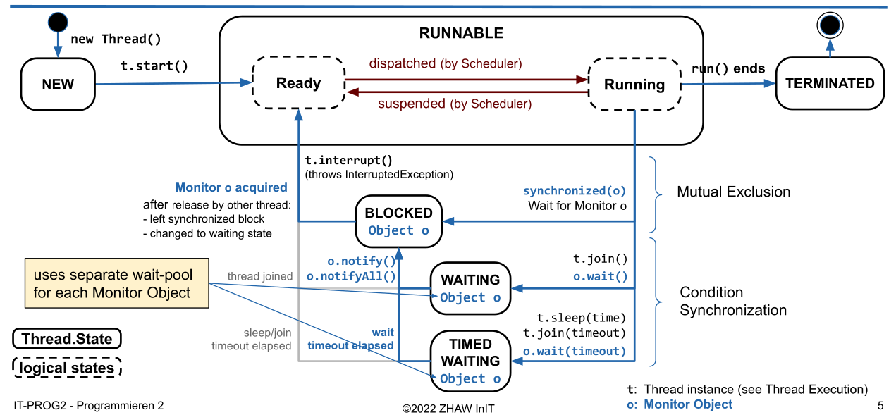
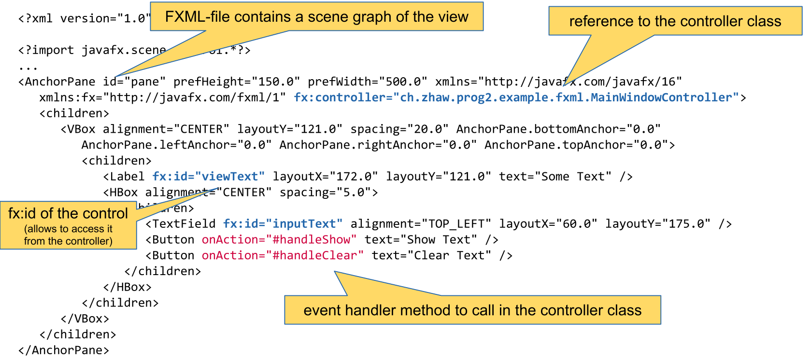

# PROG2 Summary

## Gradle

## Concurrency

### Types of Concurrencies

There are multiple types of concurrencies:

* True concurrency
  On a computer with more multiple cores, each core can run a flow independently
* Interleaving concurrency
  Each flow gets a slice of time. After that time the flow will be paused and the core will work on another flow.
  The scheduler controls which core works on which flow

#### Strategies for Interlaving Concurrency

* Non-Preemptive (cooperative)

  The process releases the core voluntarily 
  Tyes: FCFS(First comes, first served), SNP(shortest process next). This was how it was in the olden days 

* Preemtive 
  A scheduler can interrupt a process

### Program vs Process vs Thread

A program is a sequence of instructions and can consists of multiple processes.

A **process** executes a program or part of it and can consists of multiple threads. Each process has its own memory, uses IPC (Inter-Process-Communication) to communicate to other processes and switching between processes is expensive.

A **thread** is part of a process and runs one flow. It shares its memory with the other threads in the same process and switching between thread is cheap.


### Java-Concurrency

#### Thread

* `Thread.sleep()` doesn't gurantee that sleep doesn't wake up early or late
* `Object.yield()` will advice the scheduler to release the thread, but there is guarantee that the thread will be suspened
* With `Thread.currentThread()` one can get the thread which runs the current thread
* `Thread.stop()`, `Thread.suspend()` and `Thread.resume()` are depricated and potentialy unsafe

```java
public static void main (String[] args) {
    System.out.println("START: main");
    Thread java = new JoinThread("Java");
    Thread fiji = new JoinThread("Fiji");
    java.start();
    fiji.start();
    System.out.println("Wait for theads..");
    try {
        java.join(); // blocks until java ends
        fiji.join(); // blocks until fiji ends
    } catch (InterruptedException e) {
    	System.out.println("Interrupted");
    }
    System.out.println("DONE main");
}
```


##### Lifecycle of a Thread



A Thread is considered "alive" and `Thread.isAlive()` will return true, when the Thread is either ready, running oder suspended (the blocks with the dotted outline). This means that `run` needs to start running before the Thread is alive.

### Executor Framework

```java
// Example of a Sheduled Executor
public static void main(String[] args) {
    ScheduledExecutorService scheduledExecutor = Executors.newScheduledThreadPool(2);
    
	scheduledExecutor.execute(new ScheduledTask(0, System.currentTimeMillis()));
    Future<?> future = scheduledExecutor.submit(new ScheduledTask(0, System.currentTimeMillis()));
    
    scheduledExecutor.schedule(new ScheduledTask(1, System.currentTimeMillis()), 4, TimeUnit.SECONDS);
    scheduledExecutor.scheduleAtFixedRate(new ScheduledTask(2, System.currentTimeMillis()),4,3,TimeUnit.SECONDS);
    
    scheduledExecutor.scheduleWithFixedDelay(new ScheduledTask(3, System.currentTimeMillis()),2,3,TimeUnit.SECONDS);
    
    try {
    	TimeUnit.SECONDS.sleep(20); // waiting for 20s
    } catch (InterruptedException e) { }
    scheduledExecutor.shutdown();
}

private static record ScheduledTask(int id, long starttime) implements Runnable {
    @Override
    public void run() {
        System.out.println("Executing Task " + id +
        " at " + (System.currentTimeMillis()-starttime) + " ms after start " +
        " in Thread : " + Thread.currentThread().getName());
    }
}
```


####         Executor Service


An `Executor` just promises to execute a given task.

An `ExecutorService` extends `Executor` to allow to shutdown the Executor and to track the progress and the state of a task. The `shutdownNow()` method uses `Thread.interrupt()` under the hood and is thus not deprecated.

The `ScheduledExecutorService` extends the `ExecutorService` to allow a task to be scheduled. The method signitures of the new methods are: 

* `schedule(Runnable task, long delay, TimeUnit unit)`,
* `scheduleAtFixedRate(Runnable task, long initialDelay, long period, TimeUnit unit)`
* `scheduleWithFixedDelay(Runnable task, long initialDelay, long delay, TimeUnit unit)`

#### Thread Pools

A thread pool uses multiple threads which are reused for multiple tasks. Thread pools usually use a queue to hold the tasks to be executed.

A special kind of thread pool is a **Blocking Queue**, which when it's full, will reject newly submitted tasks.

Most `Executor Services` use thread pools underneath.

#### Different Executors

| Executor Name                                         | Description                                                  |
| ----------------------------------------------------- | ------------------------------------------------------------ |
| `Executors.newSingleThreadExecutor()`                 | Creates an Executor which only uses one thread               |
| `Executors.newFixedThreadPool(int numOfThreads)`      | Creates an Executor which has the given number of threads. Those thread will be reused |
| `Executors.newCachedThreadPool()`                     | Creates new threads as needed. It will retain Threads for an amount of time (approx. up to 60s) and will stop it after. |
| `Executors.newScheduledThreadPoool(int numOfThreads)` | Creates a new scheduled thread pool with the given number of threads. |
| `Executors.newSingleThreadExecutor()`                 | Creates a new scheduled executor with a single thread        |

### Callable and Futures

```java
public interface Callable<V> {
	V call() throws Exception;
}
```

A `Callable` will return a result or an exception and can also be submitted to an `ExecutorService` and a `Future<V>` will be returned.

```java
public static void main(String[] args) throws InterruptedException, ExecutionException, TimeoutException {
    ExecutorService service = Executors.newSingleThreadExecutor();
    Future<String> future = service.submit(() -> "Hello world");
    String result = future.get(); // waits until the future completes
    result = future.get(1, TimeUnit.SECONDS); // will throw TimeoutException after 1 second
    future.cancel(<mayInterruptIfRunning>); // will cancel the future
    future.isDone(); // returs if the future is done
    future.isCancelled(); // returns if the future was cancelled
}
```

### Patterns

#### Wait for all Tasks to finish

```java
List<Future<?>> futureList = executorService.invokeAll(taskList);
for(Future<?> future : futureList) {
	future.get(); // wait for each future
}
```

#### Wait for the fastest task to finish

```java
String result = executorService.invokeAny(taskList);
/*
The result of the task which completed first, is returned
*/
```

## GUI

### Scene Graph

A scene Graph is a cycle free graph of nodes. It contains **one** root node.


### Panes

* **Group**
  All children keep their size and it is just large enough to contain all children

* **Region**
  Is the base class of all panes and controlls and defines minimum, maximum and desired size

* **Pane**
  The size of the pane and the layout of its children can be manually set; clipping is possible

* **HBox/VBox**
  Aligns the children horizontally or vertically
  

* **BorderPane**
  Defines 5 regions. Nodes are added by `setCenter(Node)`, `setLeft(Node)`, ...

* **GridPane**
  The children are aranged in a table. Nodes are added with `add(Node, column, row)`

* **FlowPane**
  Automaticly aranges nodes in a new row/column, when the size of the pane is filled.

* **AnchorPane**

  Nodes can be anchored to multiple edges. This allows for a flexible layout. A node is added with `getChildren().add(Node)` and can be attached to an edge with `setTopAnchor(Node, distance)`, `setLeftAnchor(Node, distance)`, `setBottomAnchor(Node, distance)` and `setRightAnchor(Node, distance)`.

* **TilePane** 
  Every Node gets the same amount of space in a grid. Like in a `FlowPane`, nodes are wrapped to the next line if the size of the pane is filled. Either a max tile size is set or the biggest child is used as a reference. Nodes are added with `getChildren().add(Node)`.

### Events


An event has two phases:

1. **Event Capturing Phase**:
   The event is passed up from the origin node to the stage. On each node, its `EventFilter` is invoked
2. **Event Bubbling Phase**
   The event is passed back up from the stage to the origin node. On each node, its `EventHandler` is called.

An event handler can be added to a node via their respective methods:

```java
Button button = new Button("test");
button.setOnAction((ActionEvent event) -> {});
button.setOnAction(new EventHandler<ActionEvent> {
    @Override
    public void handle(ActionEvent event) {}
});
button.setOnMouseClicked((MouseEvent event) -> {});
```

All event handlers are `EventHandler<? extends Event>`

### Demo App

```java
public class App extends Application {
    @Override
    public void start(Stage primaryStage) throws Exception {
    	FXMLLoader loader = new FXMLLoader(getClass().getResource("test.fxml"));
        Parent parent = loader.load();
        Scene scene = new Scene(parent);
        stage.setTitle("Test");
        stage.setScene(scene);
        stage.setMinWidth(400);
        stage.setMinHeight(600);
        // if this is  a new stage
        stage.initOwner(parentStage);
        // disables events for owner windows only
        stage.initModality(Modality.WINDOW_MODAL);
        // disables events for all app windows
        stage.initModality(Modality.WINDOW_MODAL);
        stage.show();
        // or stage.showAndWait(); to block until modal window is closed
        // create new Stage (primaryStage= new Stage()) to open a new window
    }
}
public class Controller {
    @FXML
    private BorderPane rootPane;
    
    @FXML
    public void initialize() {
        rootPane.setStyle("-fx-bakground-color: red;");
        rootPane.setLayoutX(0);
        rootPane.setLayoutY(0);
    }
}
```

### MVC

> **Model**: Contains the data with the domain logic, but it has to be independent from the View-Classes.
>
> **View:** The UI components which render the data. The view doesn't call the model directly (usually), but it knows about the types of the model (for example via generics).
>
> **Controller:** The glue between the model and the UI. It listens to events from the UI and calls the model accordingly
>
> 

The benefits of this pattern are:

* Independent development and testing of model and UI
* Its possible to have multiple views and controllers for one model
* Changes to the UI or model are far easier

### FXML



### Properties and Bindings

```java
IntegerProperty prop = new SimpleIntegerProperty(3);
prop.addListener(new ChangeListener<Number>() {
    public void changed(ObservableValue<? extends Integer> o, Number oldVal, Number newVal) {}
});
prop.getValue(); // returns the value
prop.setValue(4); // sets the value
prop.bind(otherProp); // binds the prop to the otherProp
prop.bindBidirectional(otherProp); // binds the two properties bidirectionally

```

