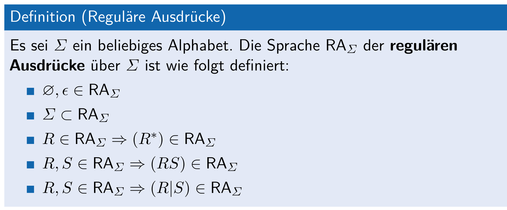

# RegEx

## Syntax vs Semantik

Der Syntax sagt aus, wie die Symbole des Alphabetes zu Wörter angeordnet werden.

Die Semantik sagt aus, was die Symbole bedeuten (z.B. dass die Zahl 101 im Zehnersystem die Zahl 5 ist.)

## Syntax

* $(0|1)$ - entweder 0 oder 1 (Manchmal wird dies auch als $(0+1)$ geschrieben)
* $x^*$ - beliebig oft $x$, auch null mal
* $x^+=xx^*$ - mindestens 1-mal $x$
* $x?=(x|\epsilon)$ - $x$ ist optional
* $\epsilon$ - eine leere Regular-Expression. Diese matcht nichts
* $[x_1, x_2, ...,x_k]=x_1|x_2|...|x_k$ 
* $\oslash$ - eine leere Menge von Regular-Expressions
* $\O$ - eine leere Sprache

### Regular-Expression-Sprache

> Die Sprache $RA_\Sigma$ i
>
> Eine Menge von Regexe für das Alphabet $\Sigma$ ist eine Sprache über dem Alphabet $\{\O, \epsilon, ^*, (, ), \vert\} \cup \Sigma$
>
> "Punkt vor Strich"-Regeln für Regex:
>
> * $^*$ vor Konkatenation
> * Konkatenanation vor $\vert$

#### Definitionen

* $L(\emptyset)=\emptyset$
* $L(\epsilon)=\{\varepsilon\}$
* $L(a)=\{a\}$
* $L(R^*)=L(R)^*$
* $L(R|S)=L(R) \cup L(S)$
* $L(RS)=L(R)L(S)$

## Wann ist Sprachen regulär

Eine Sprache nennt sich regulär, wenn sie mit einem Regulären Ausdruck gebildet werden kann. Dafür gibt es eine Regeln:

Die Sprache $L_1$ und $L_2$ sind jeweils regulär:

1. $L_1L_2$ ist regulär
2. $L_1\cup L_2$ (Vereinigung) ist regulär
3. $L_1\cap L_1$ (Schnittmenge) ist regulär
4. $L_1\setminus L_2$ (Differenz) ist regulär
5. $L_1^*$ ist regulär
6. $\overline {L_1}$ ist regulär

**Kurz gesagt: Wenn zwei Sprachen regulär sind, ist das Resultat von einem Operator mit diesen Sprachen regulär**

# Fragen

1. Kommt es nicht auf den Regex darauf an, ob das Alphabet eine Teilmenge der Sprache ist?
2. Wenn $R$ ein Wort ist, wäre die Kleenische Hülle nicht eine Sprache? Wenn ja, wieso ist eine Sprache ein Element einer anderen Sprache?
3. Was bedeutet $\O$?
4. Was ist die Kleenische Hülle eines Regex? (Folie 7)