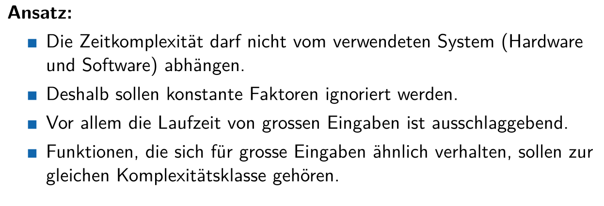
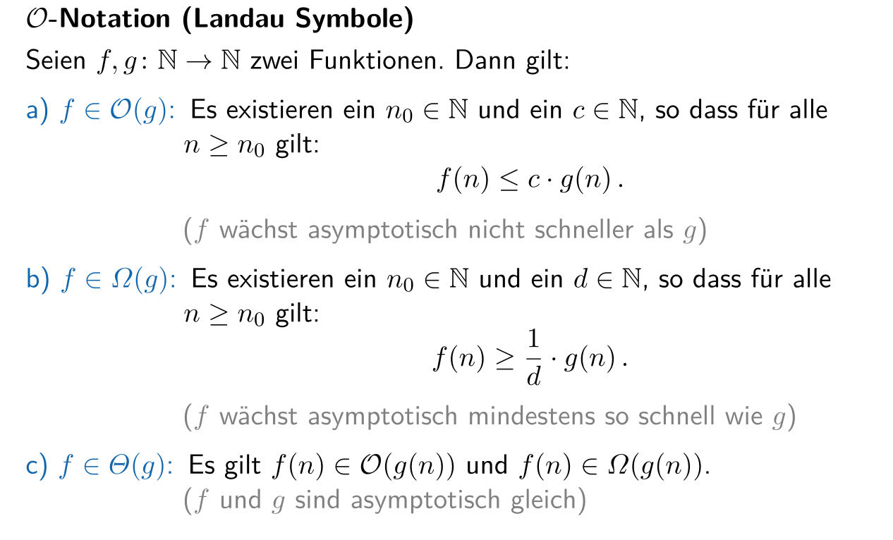
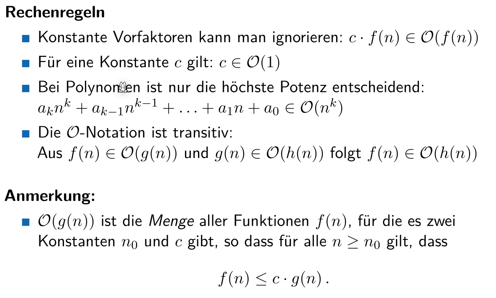

# Komplexitätstheorie

Es gibt mehrere Arten von Komplexität:

* **Zeitkomplexität**: Laufzeit des besten Programms, welche ein Problem löst
* **Platzkomplexität**: Speicherbedarf des bestens Programmes
* **Beschreibungskomplexität**: Länge des kürzesten Programmes

## Big-O-Notation (Landau Symbol)

 	

Im folgende Beispiel gilt: 

* $7n+4\in \mathcal O(n)$ für $n \ge 6 = n_0$
* $0.5n^2+5n - 4 \in \mathcal O(n^2)$

### Bespiel an Turing Maschinen

## 

## Klassifizierung von Problemen (NP vs P)

## Polynomzeit Verifizieren

Ein Polynomzeit-Verifizierer ist eine Turing-Maschine, welche in polynomen Zeit ($\mathcal O(n^k)$, wobei gilt $k \in \N$) überprüft, ob das Resultat einer Berechnung stimmt.

**Frage: ** Sind p-Verifizierer und Polynomzeit-Verifizierer das selbe?

Alle Probleme, welche ein Polynomzeit-Verifizierer haben, sind in der Gruppe $NP$ enthalten.

## Polynomielle Reduktion

Eine Sprache $L_1$ ist **polynominell** auf $L_2$ **reduzierbar** ($L_1 \preceq_p L_2$), wenn eine Turing Maschine gebaut werden kann, welche von $L_1$ zu $L_2$ umwandeln kann. Dies muss in $O(n^k)$ möglich sein.

## NP-Schwer und NP-Vollständig

Ein Problem ist **NP-schwer**, wenn es auf alle NP-Probleme (Probleme, welche mit einer Nicht-Deterministiersch-Maschine lösbar/verifizierbar sind) reduzieren lässt. Aus dem geht hervor, dass ein Problem, welches NP-schwer ist, gleich schwer oder schwerer zum lösen ist, wie alle NP-Problem einzeln.

Ein Problem ist **NP-vollständig**, wenn es ein NP-Problem und NP-schwer ist.

Ein NP-vollständiges Problem ist gleich schwer zum lösen, wie das am schwierigsten lösbaren NP-Problem.

### $P=NP$ Problem

Wenn es jemandem gelingt ein Problem zu finden, welches NP-vollständig ist und gleichzeitig auch zu P gehöhrt, dann würde gelten $P=NP$, da P zu jedem NP-Problem reduziert werden könnte.

Bis jetzt wurde kein solches Beispiel gefunden

## Konjunktive Normalform (KNF)

Ein Ausdruck, welcher in der konjuktiver Normalform steht, besteht nur aus $\neg$, $\vee$, $\wedge$, $()$ und Literale. 

Beispiele:

* $x$
* $x_1 \vee x_2$
* $x_1 \wedge x_2$
* $(x_1 \vee x_2) \wedge (x_3 \vee x_4) \wedge \neg x_5$ 

Hingegen $(x_1 \wedge x_2) \vee x_3$ wäre nicht in der konjunktive Normalform

## SAT

SAT war das "erste" NP-vollständige Problem. Anhand diesem wurden alle weiteren Beweise für NP-Vollständigkeit aufgehängt.

Das SAT Problem ist zu einscheiden, ob eine Formel in der KNF erfüllbar ist. Also es sicherlich eine Belegung gibt, welche `1` zurück gibt.

Es muss gezeigt werden das:

* $SAT \in NP$: Es ist möglich eine Nicht-Deterministische Maschine zu bauen, welche überprüfen kann, ob eine Formel erfüllbar ist
* SAT ist NP-schwer: Das Problem kann zu allen NP-Problemen reduziert werden

## NP-Vollständigkeits-Nachweis weiteren Problemen

> **Satz**
> Wenn $P1$ NP-schwer und $P2$ in NP enthalten ist und eine polynomielle
> Reduktion $P1 \preceq_p P2$ existiert, dann ist $P2$ NP-vollständig.

Dass heisst, wenn ein Problem in NP enthalten ist und es eine Reduktion zu dem SAT Problem gibt, dann ist es NP-vollständig.